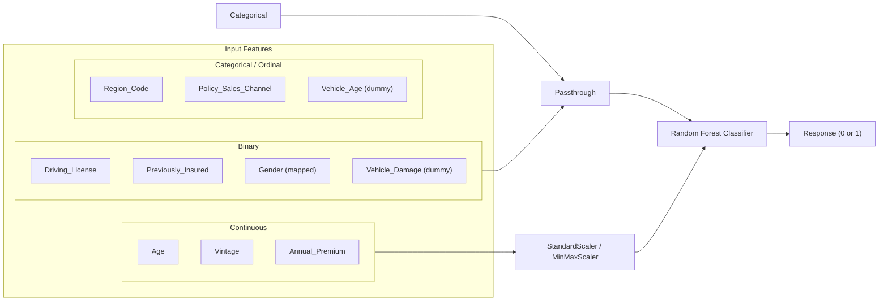
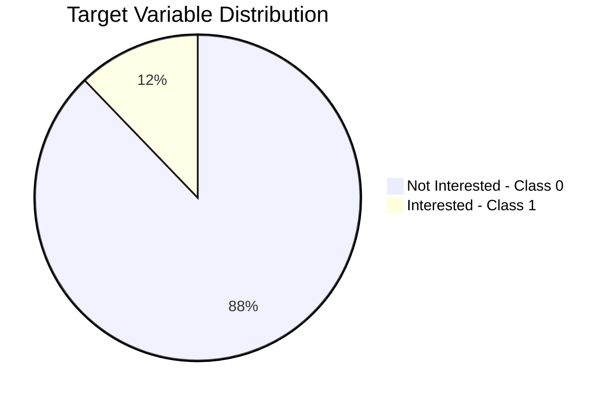

# 01. Project Overview

## 🎯 Business Goal & Objectives

The primary objective of this project is to build an end-to-end Machine Learning operations (MLOps) system that predicts whether a customer will be interested in **Vehicle Insurance** based on their demographics, vehicle details, and historical policy information.

This prediction allows insurance providers to optimize their marketing strategies, target high-probability customers, and significantly reduce operational outreach costs.

---

## 📊 Dataset Feature Specifications

The data is stored and fetched dynamically from MongoDB Atlas. Each record contains the following features:

| Feature Name | Data Type | Description | Values / Examples |
| :--- | :--- | :--- | :--- |
| `id` | Integer | Unique identifier for the customer. | `1`, `2`, `3` |
| `Gender` | Categorical | Gender of the customer. | `Male`, `Female` |
| `Age` | Integer | Age of the customer in years. | `44`, `76`, `21` |
| `Driving_License` | Binary | Customer possession of driving license. | `0: No License`, `1: Has License` |
| `Region_Code` | Float/Int | Unique code representing customer's region. | `28.0`, `3.0`, `11.0` |
| `Previously_Insured` | Binary | Whether the customer already has vehicle insurance. | `0: No`, `1: Yes` |
| `Vehicle_Age` | Categorical | Age of the vehicle. | `< 1 Year`, `1-2 Year`, `> 2 Years` |
| `Vehicle_Damage` | Categorical | Whether the customer's vehicle was damaged in the past. | `Yes`, `No` |
| `Annual_Premium` | Float | The annual premium amount the customer has to pay. | `40454.0`, `33536.0` |
| `Policy_Sales_Channel` | Float/Int | Anonymized code representing outreach channels (agents, mail, phone). | `26.0`, `152.0` |
| `Vintage` | Integer | Number of days the customer has been associated with the company. | `217`, `183`, `39` |
| **`Response`** | Binary | **Target Variable**: Interest in vehicle insurance. | `0: Not Interested`, `1: Interested` |

---

## ⚡ Target Variable Definition

The target variable is `Response`.
*   **`Response = 1`**: The customer is interested in buying vehicle insurance.
*   **`Response = 0`**: The customer is not interested.

---

## 📊 Feature Category Breakdown

The dataset features can be categorized into distinct groups based on their data types and preprocessing requirements:

## ⚖️ Class Distribution

The target variable `Response` exhibits severe class imbalance:

This imbalance means a naive model predicting `0` for every input achieves ~88% accuracy while failing to identify any potential customers.

---

## ⚠️ Key MLOps & Machine Learning Challenges

1.  **Extreme Class Imbalance**:
    *   In the training dataset, only about **12.2%** of customers responded positively (`Response = 1`), while **87.8%** responded negatively (`Response = 0`).
    *   *ML Challenge*: A naive model predicting `0` all the time yields ~88% accuracy. We must focus on **F1-Score**, **Precision**, and **Recall** rather than raw accuracy.
    *   *Solution*: The project implements **SMOTEENN** (Synthetic Minority Over-sampling Technique edited Nearest Neighbors) during the data transformation stage to balance the training classes.

2.  **Diverse Feature Types**:
    *   The dataset contains continuous features with highly varied scales (e.g., `Age` spans 20-80, while `Annual_Premium` goes from 2,630 to 540,000+).
    *   *Solution*: A hybrid pipeline is constructed. Continuous values like `Age` and `Vintage` are standardized using `StandardScaler`. `Annual_Premium` is scaled using `MinMaxScaler`.

3.  **Data Processing Consistency**:
    *   During deployment, the FastAPI server accepts individual form requests as JSON/Form elements. The pipeline must transform single web inputs exactly how it transformed the batch training data to prevent **feature mismatch**.
    *   *Solution*: The preprocessor `ColumnTransformer` object is fit on the training dataset, serialized as `preprocessing.pkl`, and loaded dynamically during production inference.

4.  **Production Model Comparison**:
    *   Deploying a bad model can degrade business metrics.
    *   *Solution*: The MLOps pipeline includes an automated validation check. The new model is evaluated on the test set and compared against the current production model fetched from AWS S3. The new model is only pushed to ECR/S3 if its performance (F1-score) is strictly better than the current model by a threshold.
