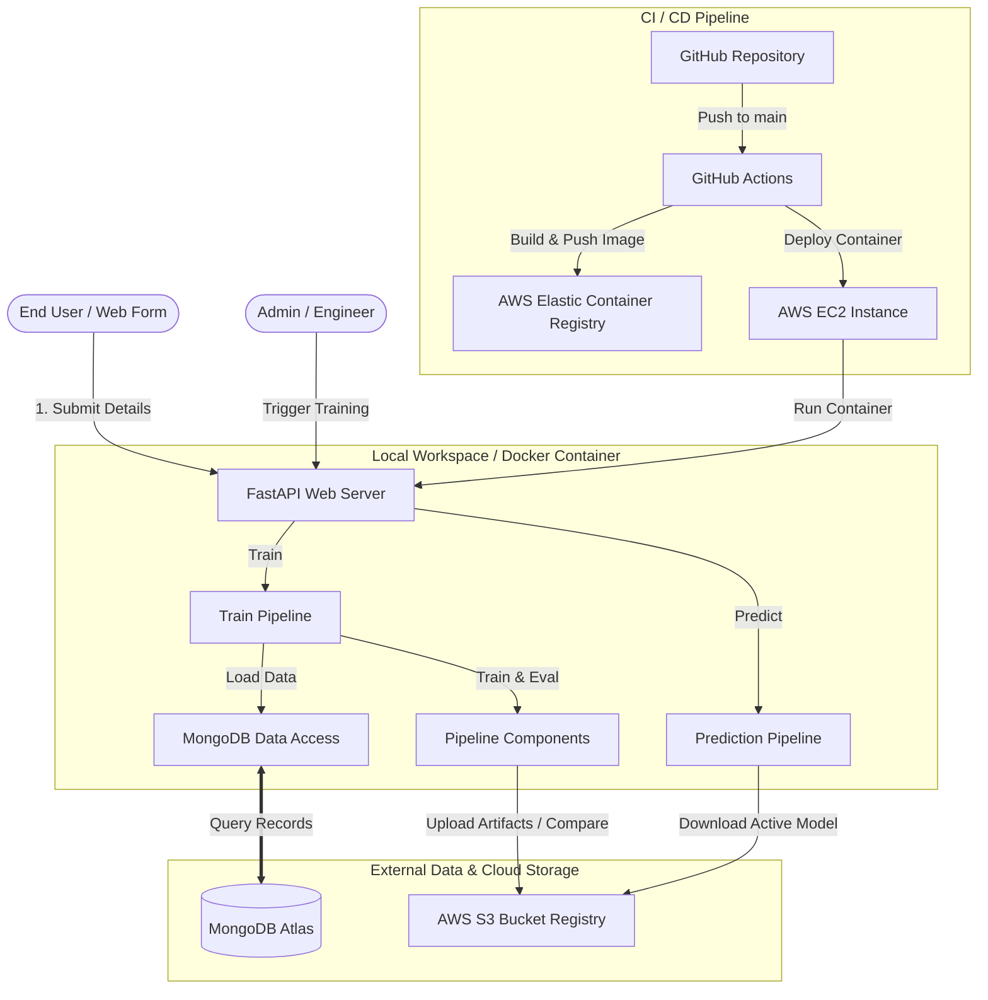
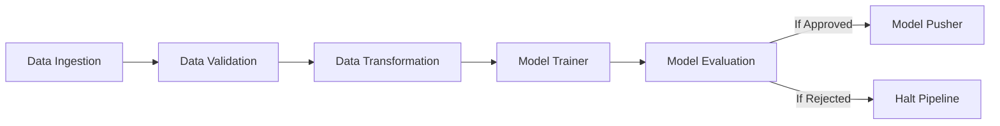
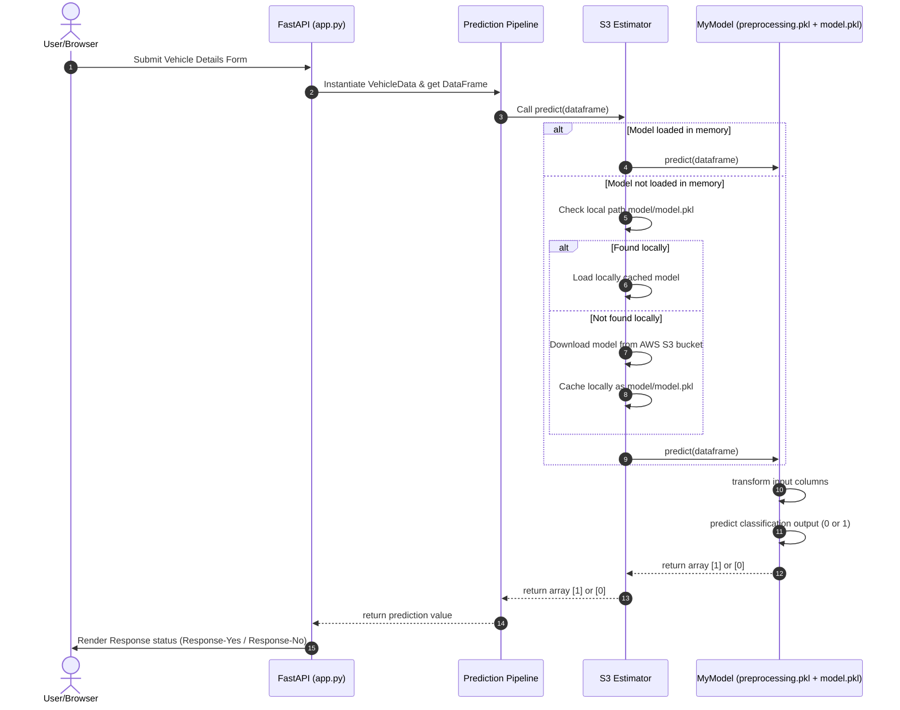

# 02. System Architecture

The Vehicle Insurance prediction application follows a modular, component-driven MLOps architecture. The system integrates storage resources, a serialized pre-processing/model pipeline, a FastAPI web-serving layer, and a GitHub Actions CI/CD deployment pipeline targeting AWS cloud resources.

---

## 🏗️ High-Level System Architecture



---

## 🔄 Pipeline Components Walkthrough

### 1. Training Pipeline Lifecycle
The training pipeline executes sequentially across 6 distinct phases:



*   **Data Ingestion**: Pulls records from MongoDB Atlas collection `Proj1-Data`, saves them locally into a feature store CSV, splits the dataset into a `train.csv` and `test.csv` (75/25 split ratio), and returns output file paths.
*   **Data Validation**: Reads the schema configuration from `schema.yaml`, validates the column count, confirms data types exist for categorical and numerical features, and creates a JSON report (`report.yaml`).
*   **Data Transformation**: Applies column transformations (mapping gender to binary, creating dummies for categorical age/damage fields, scaling premium with MinMaxScaler, and scaling age/vintage with StandardScaler). Resolves class imbalance using **SMOTEENN**, returning balanced train/test numpy arrays and serializing the fit transformer as `preprocessing.pkl`.
*   **Model Trainer**: Trains a `RandomForestClassifier` with hyperparameter values, checks that the training accuracy matches the expected accuracy threshold (>= 60%), bundles the preprocessing object with the model inside a `MyModel` container, and saves it locally.
*   **Model Evaluation**: Downloads the current production model from AWS S3, evaluates both models on the test set, calculates F1-scores, and determines if the newly trained model outperformed the production model by at least a threshold (0.02).
*   **Model Pusher**: If accepted, uploads the new model to the AWS S3 bucket registry. Also updates the local model cache directory (`model/model.pkl`) to allow immediate predictions.

---

## 🔮 Prediction Pipeline Lifecycle

When a user submits vehicle features via the web application, the request flows as follows:



---

## 🚢 CI/CD Deployment Flow

Deployments are automated on pushes to the `main` branch.

```mermaid
flowchart TD
    subgraph CI Job (GitHub runner)
        Checkout[Checkout Repository] --> ConfigAWS[Configure AWS Credentials]
        ConfigAWS --> LoginECR[Login to Amazon ECR]
        LoginECR --> BuildDocker[Build & Tag Docker Image]
        BuildDocker --> PushECR[Push Image to Amazon ECR]
    end

    subgraph CD Job (EC2 Self-Hosted runner)
        PushECR --> LoginECR_CD[Login to Amazon ECR on EC2]
        LoginECR_CD --> PullRun[Run Docker container on Port 5000]
    end
```

*   **Self-Hosted CD Execution**: The CD job runs directly on the target AWS EC2 instance where a GitHub Actions runner is active.
*   **Environment Injection**: Environment variables (`AWS_ACCESS_KEY_ID`, `AWS_SECRET_ACCESS_KEY`, `AWS_DEFAULT_REGION`, and `MONGODB_URL`) are extracted from GitHub repository secrets and passed into the docker run command to allow containerized database and S3 communication.
