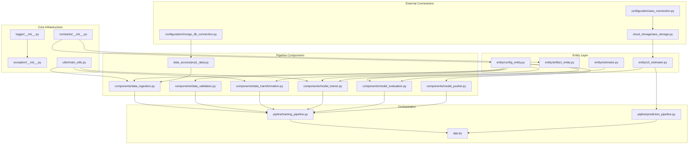

# 03. Folder Structure

The project layout divides business logic, ML pipelines, deployment configurations, and static web resources into structured subdirectories. This architecture isolates data access, preprocessing, entity definitions, and operational scripts.

---

## 📂 Directory Tree Layout

Below is a complete representation of the project's folder layout:

```text
Vehicle-Insurance/
├── .github/
│   └── workflows/
│       └── aws.yaml                 # GitHub Actions CI/CD workflow configuration
├── config/
│   ├── model.yaml                   # Hyperparameter configurations (unused/placeholder)
│   └── schema.yaml                  # Columns, numerical/categorical lists, scaling mapping
├── notebook/
│   ├── data.csv                     # Sample vehicle dataset (21MB)
│   ├── experiment_notebook.ipynb    # Model experimentation, hyperparameter search, EDA
│   ├── mongoDB_demo.ipynb           # MongoDB connection testing and data upload script
│   └── rf_model.pkl                 # Reference serialized RandomForest model from notebooks
├── src/
│   ├── __init__.py                  # Exposes src as a Python package
│   ├── cloud_storage/
│   │   ├── __init__.py
│   │   └── aws_storage.py           # S3 bucket reads, writes, model loads, uploads
│   ├── components/
│   │   ├── __init__.py
│   │   ├── data_ingestion.py        # Connects to MongoDB, pulls data, exports CSV, splits train/test
│   │   ├── data_validation.py       # Validates columns and data types against schema
│   │   ├── data_transformation.py   # Processes categoricals, scales values, SMOTEENN resample
│   │   ├── model_trainer.py         # Fits RandomForest, validates accuracy, saves MyModel
│   │   ├── model_evaluation.py      # Pulls production model from S3, compares test metrics
│   │   └── model_pusher.py          # Uploads approved model to S3 bucket registry
│   ├── configuration/
│   │   ├── __init__.py
│   │   ├── aws_connection.py        # Establishes boto3 resource/client connection using env credentials
│   │   └── mongo_db_connection.py   # Establishes pymongo MongoClient with CA file (TLS)
│   ├── constants/
│   │   ├── __init__.py              # Central definitions for MongoDB, AWS keys, scaling features
│   │   └── __pycache__/
│   ├── data_access/
│   │   ├── __init__.py
│   │   └── proj1_data.py            # Custom DB exporter converting MongoDB collection to DataFrame
│   ├── entity/
│   │   ├── __init__.py
│   │   ├── artifact_entity.py       # Dataclasses defining inputs/outputs between components
│   │   ├── config_entity.py         # Dataclasses mapping directory paths and constants for runs
│   │   ├── estimator.py             # MyModel wrapper packaging preprocessor + model
│   │   └── s3_estimator.py          # Proj1Estimator wrapper handling S3 download/caching/predict
│   ├── exception/
│   │   ├── __init__.py              # MyException handler extracting detailed script file/lines
│   │   └── __pycache__/
│   ├── logger/
│   │   ├── __init__.py              # Rotating file logger setup (DEBUG levels to file, INFO to stream)
│   │   └── __pycache__/
│   ├── pipline/                     # Note: Folder spelling is "pipline"
│   │   ├── __init__.py
│   │   ├── prediction_pipeline.py   # Maps form records, manages estimator prediction responses
│   │   └── training_pipeline.py     # Sequentially triggers ingestion, validation, trainer, pusher
│   └── utils/
│       ├── __init__.py
│       └── main_utils.py            # YAML reader/writer, dill loader/saver, numpy saver/loader
├── static/
│   └── css/
│       └── style.css                # Stylings for form webpage UI layout
├── templates/
│   └── vehicledata.html             # HTML user form rendering prediction responses
├── .dockerignore                    # Excludes artifacts, venv, logs from Docker context
├── .gitignore                       # Excludes local models, notebooks, environments from git
├── app.py                           # Main FastAPI application routes (index, train, predict)
├── demo.py                          # Independent script to trigger TrainPipeline locally
├── Dockerfile                       # Python 3.10 deployment packaging
├── LICENSE                          # License terms
├── practice_ulr.py                  # Short test script (unused/temporary)
├── pyproject.toml                   # Modern Python build-system configuration
├── requirements.txt                 # Project dependencies list
├── setup.py                         # Packages workspace using setuptools
├── template.py                      # Scaffolding generation script
└── workflow.txt                     # Text note indicating order of code development
```

---

## 🏷️ Role of Main Directories

*   **`src/`**: The core package. Contains the functional modules.
    *   `src/components/`: Individual stages in our pipeline. Each component reads from artifacts produced by previous components and yields a new artifact.
    *   `src/entity/`: Defines configuration settings (`config_entity`) and serialization interfaces (`artifact_entity`), as well as model classes (`estimator`). This creates a shared contract across all stages.
    *   `src/configuration/`: Manages external connections (AWS and MongoDB Atlas).
    *   `src/pipline/`: Contains pipelines. Triggers training sequences (`training_pipeline.py`) or manages inference mapping (`prediction_pipeline.py`).
*   **`config/`**: Separates variable data structures (schemas, feature groups, hyperparameters) from python code.
*   **`notebook/`**: The research environment. Used for data explorations, database testing, and model prototyping before exporting logic to `src/`.
*   **`templates/` & `static/`**: Houses files for the user-facing web interface.

---

## 🔗 Module Dependency Graph

The following diagram illustrates how modules within `src/` depend on each other:



This graph reveals the layered design: core utilities sit at the bottom, entity definitions bridge configuration and components, and the orchestration layer (pipelines and `app.py`) sits at the top.
