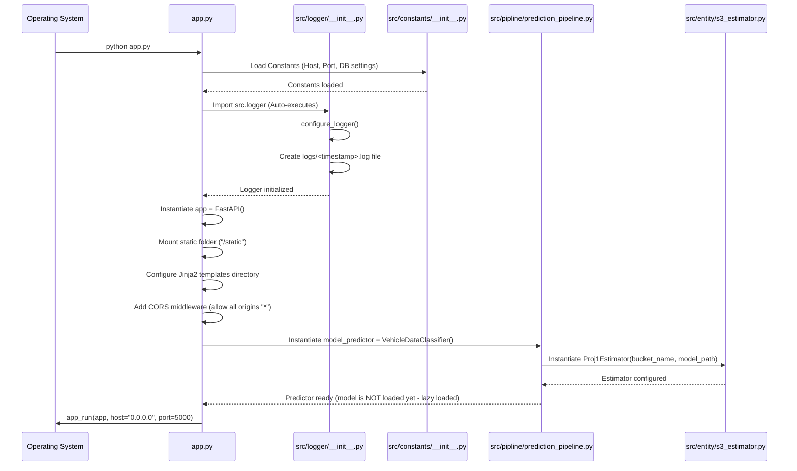
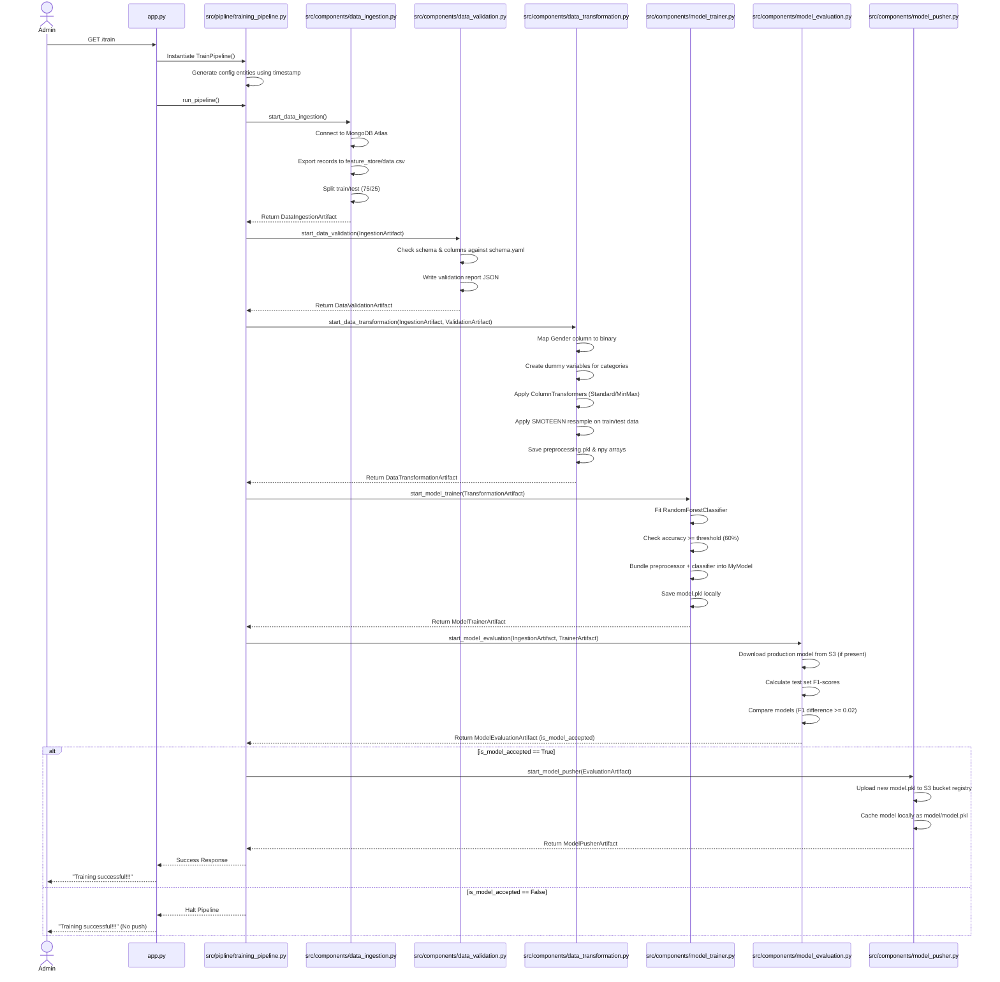
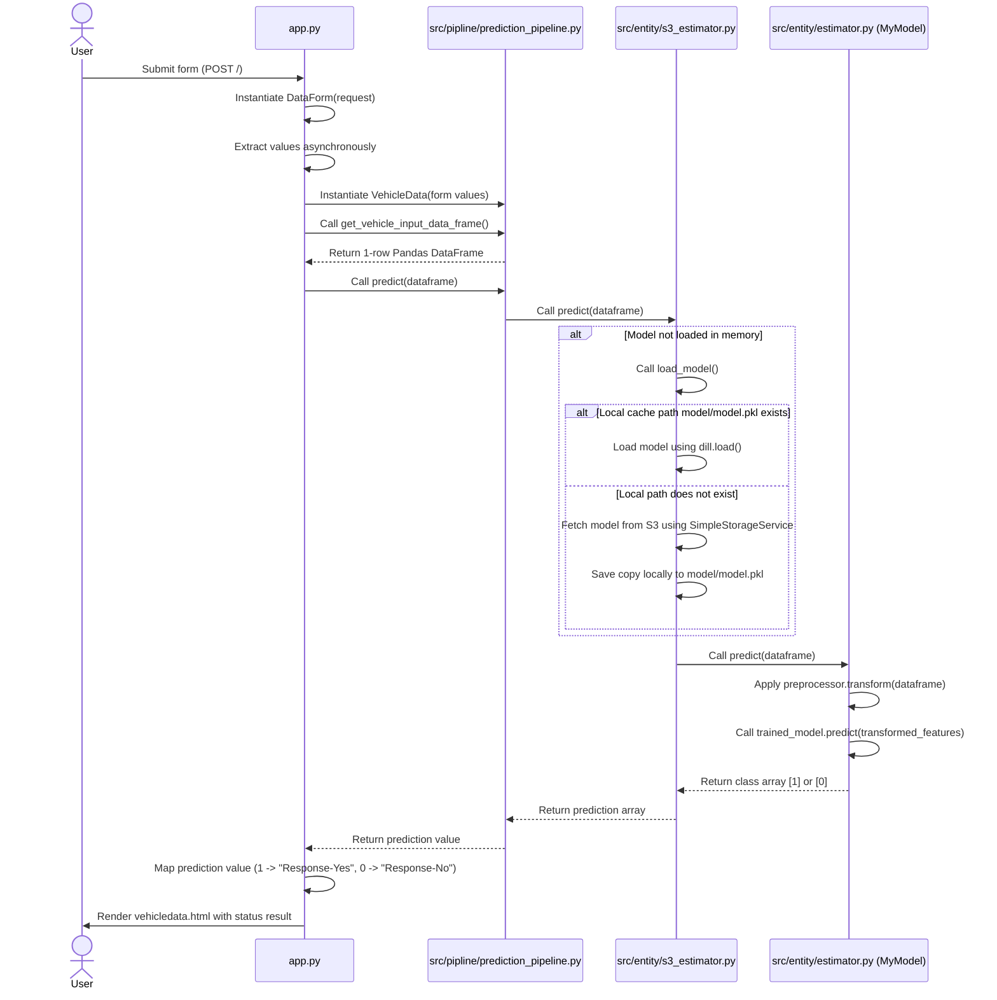

# 04. Execution Flow

This chapter traces the runtime lifecycle of the application, describing which files execute first, what objects are created, how parameters are loaded, and how components interact.

---

## 🚀 1. FastAPI Server Startup Flow

When the application is run via `python app.py` (or through the Docker container command):

1.  **Entry Point**: The OS runs `app.py`. The python interpreter processes imports.
2.  **Constants Loading**: Imports from `src.constants` are resolved. This sets global values like target column (`Response`), paths (`config/schema.yaml`), and host parameters (`0.0.0.0:5000`).
3.  **Logger Startup**: Importing `src.logger` triggers its module-level `configure_logger()` execution immediately. It creates a `logs/` folder and starts a `RotatingFileHandler`.
4.  **FastAPI Setup**: FastAPI is initialized, mounts the static CSS directory, configures Jinja2 templates, and sets CORS middleware.
5.  **Predictor Setup**: Instantiates `VehicleDataClassifier()`, which initializes a `Proj1Estimator` with default values (S3 bucket: `my-model-mlopsproject-bucket` and file key: `model.pkl`). The model itself is not loaded yet (lazy loading).
6.  **Server Listen**: The program invokes `uvicorn.run()` to start listening for incoming requests on port 5000.

---

## 🔄 2. Model Training Flow (Triggering `/train`)

When an HTTP GET request targets the `/train` endpoint:

---

## 🔮 3. Prediction Inference Flow (POST `/`)

When a user submits vehicle details on the webpage form:

