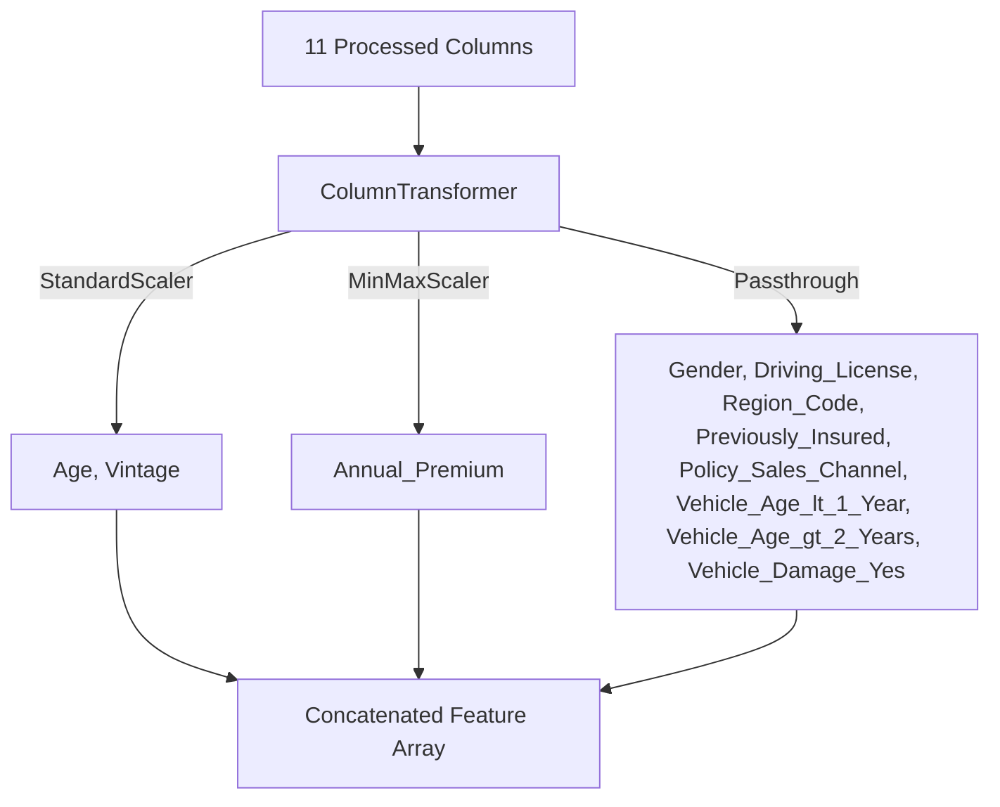
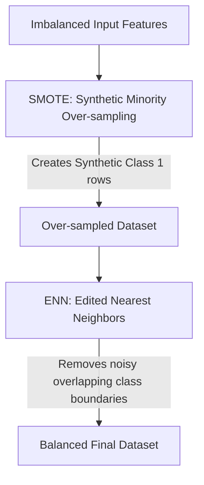
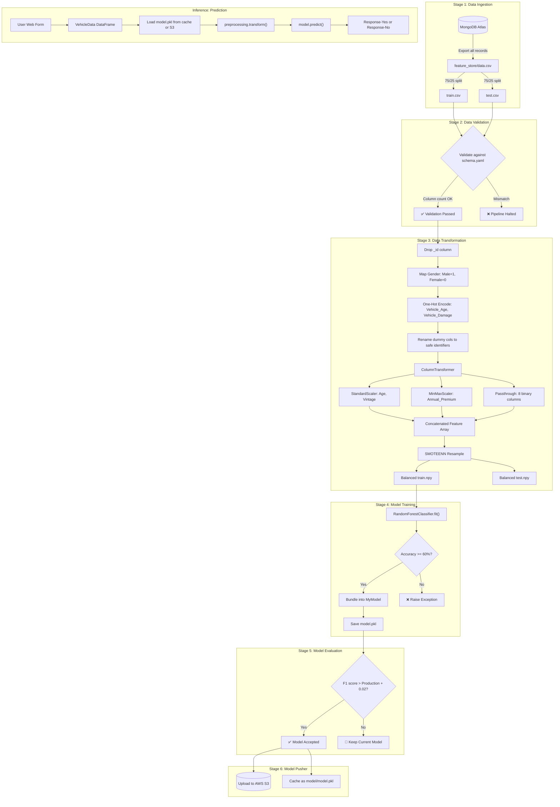

# 05. Data Flow

This chapter details the data preprocessing pipeline, outlining how data changes from raw database records to scaled features, handles class imbalance, and is processed for inference.

---

## 📥 1. Raw Data Input Format (from MongoDB Atlas)

A raw record retrieved from MongoDB Atlas contains:
```json
{
  "_id": "6a47ecb74e6dee136e09c040",
  "id": 1,
  "Gender": "Male",
  "Age": 44,
  "Driving_License": 1,
  "Region_Code": 28.0,
  "Previously_Insured": 0,
  "Vehicle_Age": "> 2 Years",
  "Vehicle_Damage": "Yes",
  "Annual_Premium": 40454.0,
  "Policy_Sales_Channel": 26.0,
  "Vintage": 217,
  "Response": 1
}
```

---

## 🛠️ 2. Step-by-Step Data Transformation Flow

During training (`data_transformation.py`), the input features undergo the following transformations:

### Step A: Target Column Separation
*   The target column `Response` is separated from the features.
*   *Input Shape*: `(N, 12)`
*   *Output Shapes*: Features `(N, 11)`, Target `(N,)`

### Step B: Gender Binary Mapping
*   The `Gender` column is mapped using a dictionary:
    *   `"Female"` ➔ `0`
    *   `"Male"` ➔ `1`
*   The values are cast to integer (`int`).

### Step C: Database ID Dropping
*   The MongoDB record primary key `_id` or the spreadsheet `id` column is dropped since it has no predictive power.

### Step D: One-Hot Encoding (Dummies)
*   Categorical columns `Vehicle_Age` and `Vehicle_Damage` are converted into dummy variables using `pd.get_dummies(df, drop_first=True)`.
*   With `drop_first=True`, the first alphabetical category is dropped to prevent multi-collinearity (the dummy variable trap).
    *   `Vehicle_Damage` (values: `Yes`, `No`) ➔ Creates `Vehicle_Damage_Yes` (drops `No`).
    *   `Vehicle_Age` (values: `< 1 Year`, `1-2 Year`, `> 2 Years`) ➔ Creates `Vehicle_Age_< 1 Year` and `Vehicle_Age_> 2 Years` (drops `1-2 Year`).

### Step E: Column Renaming & Type Casting
*   Dummy columns are renamed to standard database identifiers:
    *   `Vehicle_Age_< 1 Year` ➔ `Vehicle_Age_lt_1_Year`
    *   `Vehicle_Age_> 2 Years` ➔ `Vehicle_Age_gt_2_Years`
*   These columns and `Vehicle_Damage_Yes` are cast to integer (`int`).

---

## 📏 3. Column Scaling (ColumnTransformer)

The dataset now has 11 processed features:
`['Gender', 'Age', 'Driving_License', 'Region_Code', 'Previously_Insured', 'Annual_Premium', 'Policy_Sales_Channel', 'Vintage', 'Vehicle_Age_lt_1_Year', 'Vehicle_Age_gt_2_Years', 'Vehicle_Damage_Yes']`

The ColumnTransformer applies specific scaling methods:



1.  **`StandardScaler`**: Applied to `Age` and `Vintage`. Computes standard score:
    $$z = \frac{x - \mu}{\sigma}$$
    where $\mu$ is the mean and $\sigma$ is the standard deviation. This centers values around zero with unit variance.
2.  **`MinMaxScaler`**: Applied to `Annual_Premium`. Transforms features to a range between 0 and 1:
    $$x_{scaled} = \frac{x - x_{min}}{x_{max} - x_{min}}$$
    This normalizes premium outliers while maintaining relative variance.
3.  **`Passthrough`**: The remaining 8 binary/categorical columns are left unchanged.

---

## ⚖️ 4. Class Balancing (SMOTEENN)

Because the dataset is heavily skewed (88% class `0`), standard classifier fitting will bias towards the majority class. The transformation component resolves this using **SMOTEENN** from the `imblearn` library:



1.  **SMOTE**: Selects close examples in the minority class space (`Response = 1`), draws a line between them, and draws a synthetic new point along that line. This increases the minority class representation.
2.  **ENN**: Computes the K-Nearest Neighbors (KNN) of each point. If a point’s class differs from the majority of its neighbors, it is dropped. This cleans up noisy, overlapping decision boundaries.
3.  *Output*: The imbalanced train/test sets are converted to balanced numpy arrays and saved as `train.npy` and `test.npy` with targets concatenated on the final axis.

---

## 🔮 5. Production Prediction Inference Flow

During web inference (`app.py` ➔ `prediction_pipeline.py`):
1.  The web form submits raw values representing pre-mapped features (e.g., `Gender` is submitted directly as `1` or `0`, categories are submitted as dummy binary variables).
2.  The `VehicleData` class formats these values into a single-row Pandas DataFrame containing the exact same 11 columns in the same order as the trained preprocessor.
3.  **No SMOTEENN** is run during inference. SMOTEENN is strictly a training-time balancing technique.
4.  The serialized `ColumnTransformer` (`preprocessing.pkl`) scales the input row's `Age`, `Vintage`, and `Annual_Premium` based on the parameters ($\mu$, $\sigma$, $min$, $max$) computed during training.
5.  The scaled array is passed to the Random Forest model, which outputs a predicted class (`[0]` or `[1]`).

---

## 🗺️ 6. End-to-End Data Journey (Complete Overview)

The following diagram summarizes the entire data journey from raw MongoDB records through training to production inference:



This diagram provides a bird's-eye view connecting all six training stages with the inference path, making it easy to trace how raw MongoDB records are transformed into actionable predictions.
