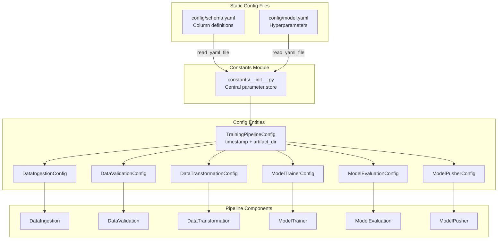

# 07. Configuration Walkthrough

This chapter details the configuration schemas, environment constants, and structural entity data models that parameterize the pipeline.

---

## 🛠️ 1. Configuration Schemas

### schema.yaml
The schema configuration file at `config/schema.yaml` provides a single source of truth for the dataset structure. It separates columns by types and defines preprocessing actions:

*   **`columns`**: Defines every column present in the raw database records and its expected type (e.g. `Gender: category`, `Age: int`, `Annual_Premium: float`).
*   **`numerical_columns`**: Columns containing numerical values that will participate in numerical processing.
*   **`categorical_columns`**: Columns containing categories that must undergo encoding (Gender, Vehicle_Age, Vehicle_Damage).
*   **`drop_columns`**: Identifies raw keys that should be dropped (e.g. `_id` created by MongoDB).
*   **`num_features`**: Numerical features target for standardization using `StandardScaler` (`Age`, `Vintage`).
*   **`mm_columns`**: Numerical features target for scaling using `MinMaxScaler` (`Annual_Premium`).

---

## 🔑 2. Environment and Hyperparameter Constants

Constants are defined in `src/constants/__init__.py`. This centralizes parameters to avoid hardcoding across pipeline stages:

*   **MongoDB Atlas settings**: Defines database `Proj1` and target collection `Proj1-Data`.
*   **AWS Environment keys**: Declares `AWS_ACCESS_KEY_ID` and `AWS_SECRET_ACCESS_KEY` environment variables. Specifies default AWS region `us-east-1`.
*   **Ingestion configuration**: Sets the train/test split ratio (0.25) and target subfolder directory names.
*   **Model Trainer parameters**: Sets the minimum model accuracy target (0.6) and hyperparameter values for RandomForestClassifier (n_estimators=200, min_samples_split=7, min_samples_leaf=6, random_state=101).
*   **Model Evaluation metrics**: Defines the minimum performance improvement threshold (F1 score difference of 0.02) required for model acceptance. Sets bucket registry parameters.
*   **App configuration**: Sets application server host (`0.0.0.0`) and port (`5000`).

---

## 🔗 Configuration Dependency Chain

The following diagram shows how configuration flows from static files through constants into entity objects used by pipeline components:



Each component receives its own config entity containing paths and thresholds derived from the pipeline-level timestamp. This ensures that all artifacts for a single run are isolated in their own timestamped directory.

---

## 📁 3. Pipeline Configuration Entities (`config_entity.py`)

Configuration entities are represented by python `dataclasses` in `src/entity/config_entity.py`. 

### Dynamic Run Isolations
To prevent pipeline runs from overwriting each other, the configuration utilizes a dynamic timestamp prefix:
```python
TIMESTAMP: str = datetime.now().strftime("%m_%d_%Y_%H_%M_%S")
```
When `TrainingPipelineConfig` is instantiated, it defines a unique directory path for the run's outputs:
```python
artifact_dir: str = os.path.join(ARTIFACT_DIR, TIMESTAMP) # e.g. "artifact/07_05_2026_14_37_47"
```

Each stage's configuration class then references this path to define output file paths:
*   `DataIngestionConfig`: Defines path targets for raw exports (`feature_store/data.csv`), training splits (`ingested/train.csv`), and test splits (`ingested/test.csv`).
*   `DataValidationConfig`: Defines validation report path targets (`data_validation/report.yaml`).
*   `DataTransformationConfig`: Defines preprocessor path targets (`transformed_object/preprocessing.pkl`) and transformed array path targets (`transformed/train.npy`, `transformed/test.npy`).
*   `ModelTrainerConfig`: Maps the trained model file path (`trained_model/model.pkl`) and hyperparameter values.
*   `ModelEvaluationConfig`: Defines metrics threshold targets and AWS registry model paths.
*   `ModelPusherConfig` & `VehiclePredictorConfig`: Maps S3 deployment targets.

---

## 📦 4. Component Artifact Entities (`artifact_entity.py`)

Artifact entities are represented by python `dataclasses` in `src/entity/artifact_entity.py`. They define structural data models representing inputs/outputs of pipeline components.

This establishes type safety across stages, preventing mismatched file parameters:

```mermaid
classDiagram
    class DataIngestionArtifact {
        +trained_file_path: str
        +test_file_path: str
    }
    class DataValidationArtifact {
        +validation_status: bool
        +message: str
        +validation_report_file_path: str
    }
    class DataTransformationArtifact {
        +transformed_object_file_path: str
        +transformed_train_file_path: str
        +transformed_test_file_path: str
    }
    class ClassificationMetricArtifact {
        +f1_score: float
        +precision_score: float
        +recall_score: float
    }
    class ModelTrainerArtifact {
        +trained_model_file_path: str
        +metric_artifact: ClassificationMetricArtifact
    }
    class ModelEvaluationArtifact {
        +is_model_accepted: bool
        +changed_accuracy: float
        +s3_model_path: str
        +trained_model_path: str
    }
    class ModelPusherArtifact {
        +bucket_name: str
        +s3_model_path: str
    }
```


*   **`DataIngestionArtifact`**: Holds absolute paths to training and testing split CSV files.
*   **`DataValidationArtifact`**: Holds a validation status boolean indicating if the data conforms to the schema.
*   **`DataTransformationArtifact`**: Holds file paths to the serialized preprocessor object and preprocessed NumPy arrays.
*   **`ClassificationMetricArtifact`**: Holds metrics computed on the test set.
*   **`ModelTrainerArtifact`**: Holds the local model file path and metrics.
*   **`ModelEvaluationArtifact`**: Holds a boolean status indicating if the model is accepted, along with S3 target model paths.
*   **`ModelPusherArtifact`**: Holds the S3 deployment bucket name and key path.
