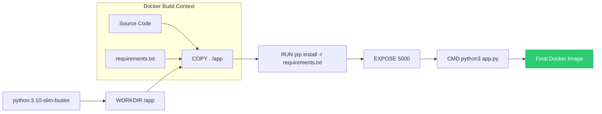
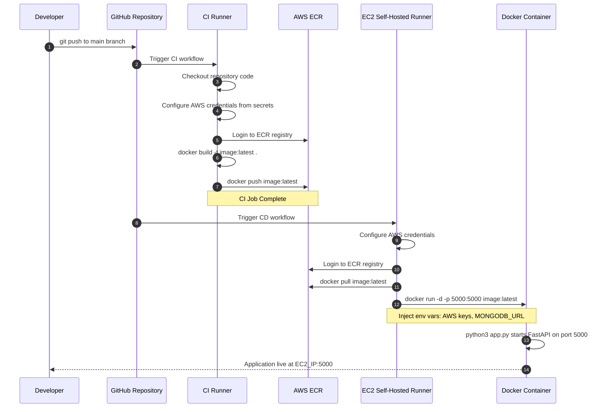
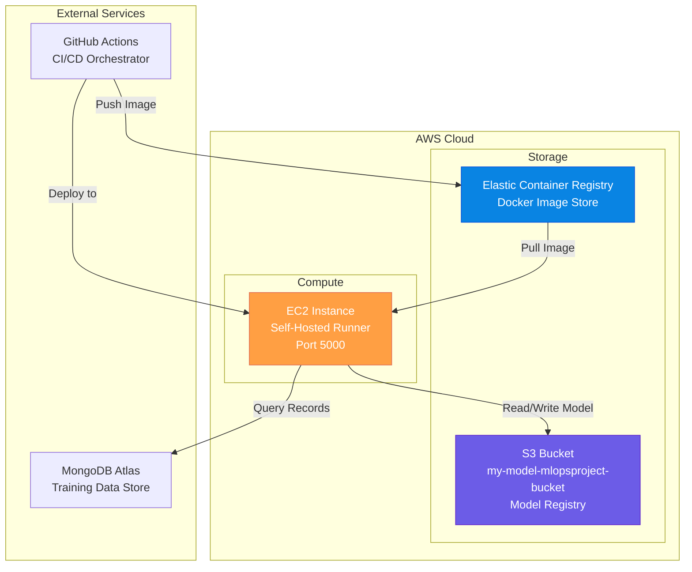

# 08. Deployment Walkthrough

This chapter documents the configuration files, containerization setups, packaging specifications, and CI/CD pipelines used to build and deploy the application.

---

## 🐳 1. Containerization

### Dockerfile
The application uses a lightweight Docker container based on Python 3.10 to package the runtime environment:
```dockerfile
FROM python:3.10-slim-buster
WORKDIR /app
COPY . /app
RUN pip install -r requirements.txt
EXPOSE 5000
CMD ["python3", "app.py"]
```
*   **Base Image**: `python:3.10-slim-buster` provides a secure, minimal Python environment (Debian-based), reducing image size and the attack surface.
*   **Working Directory**: Sets the container's active working directory to `/app`.
*   **Copy Code**: Copies the contents of the local repository into the container's `/app` folder.
*   **Dependencies**: Runs `pip install` to install all libraries listed in `requirements.txt`.
*   **Port Exposure**: Exposes port `5000`, the default port for the FastAPI server.
*   **Startup Command**: Runs `python3 app.py` to start the web application.

### .dockerignore
The `.dockerignore` file prevents copying unnecessary or sensitive local files into the Docker image, reducing build time and image size:
*   `artifact/`: Excludes local training outputs and datasets.
*   `venv/`, `env/`: Excludes local virtual environments.
*   `logs/`: Excludes local log history files.
*   `notebook/`: Excludes Jupyter notebooks, local test datasets (21MB), and local pickle files.
*   `demo.py`, `template.py`: Excludes development and scaffolding scripts.

---

## 📦 2. Packaging Configuration

The project utilizes a modern Python packaging system that integrates `setuptools` with PEP 517 build specifications:

```mermaid
graph TD
    pyproject[pyproject.toml] -->|Defines build backend| setuptools[setuptools.build_meta]
    setup[setup.py] -->|Declares package name| find_packages[find_packages()]
    pyproject -->|Reads dependencies| reqs[requirements.txt]
    reqs -->|Editable mode| install[install -e .]
```

### pyproject.toml
Declares the build-system backend and loads dependencies dynamically from `requirements.txt`:
```toml
[project]
name = "src"
version = "0.0.1"
description = "An MLOps project for productionizing models"
authors = [{name = "Vinit", email = "joshivinit57@gmail.com"}]

[tool.setuptools]
packages = {find = {}}

[tool.setuptools.dynamic]
dependencies = {file = "requirements.txt"}
```

### setup.py
Specifies metadata for packaging the codebase:
```python
from setuptools import setup, find_packages

setup(
    name="src",
    version="0.0.1",
    author="Vinit",
    author_email="joshivinit57@gmail.com",
    packages=find_packages()
)
```
*   **`find_packages()`**: Scans the project directory and automatically identifies all subfolders containing an `__init__.py` file (exposing `src/` as a distributable Python module).

### requirements.txt
Declares dependencies (e.g., `scikit-learn==1.5.2`, `pymongo`, `fastapi`, `boto3`, `imblearn`). The final line `-e .` installs the local package (`src`) in editable mode, allowing imports like `from src.logger import logging` to resolve correctly across different files.

---

## 🚀 3. CI/CD Pipeline Configuration

Automated deployments are configured in `.github/workflows/aws.yaml`. The workflow is divided into two distinct jobs:

### Job A: Continuous-Integration (CI)
*   **Trigger**: Runs on any push to the `main` branch.
*   **AWS Authentication**: Uses `aws-actions/configure-aws-credentials` to authenticate with AWS using repository secrets (`AWS_ACCESS_KEY_ID`, `AWS_SECRET_ACCESS_KEY`, and `AWS_DEFAULT_REGION`).
*   **ECR Registry Login**: Logs into AWS Elastic Container Registry (ECR).
*   **Build & Push**: Builds the Docker image locally, tags it as `latest`, and pushes it to the ECR repository (`secrets.ECR_REPO`).

### Job B: Continuous-Deployment (CD)
*   **Runner**: Runs on a `self-hosted` runner active on the target AWS EC2 instance.
*   **AWS Authentication**: Authenticates with AWS and logs into ECR.
*   **Container Execution**: Pulls the latest image from ECR and runs it as a background daemon container on port 5000:
    ```bash
    docker run -d \
      -e AWS_ACCESS_KEY_ID="${{ secrets.AWS_ACCESS_KEY_ID }}" \
      -e AWS_SECRET_ACCESS_KEY="${{ secrets.AWS_SECRET_ACCESS_KEY }}" \
      -e AWS_DEFAULT_REGION="${{ secrets.AWS_DEFAULT_REGION }}" \
      -e MONGODB_URL="${{ secrets.MONGODB_URL }}" \
      -p 5000:5000 \
      "${{ steps.login-ecr.outputs.registry }}"/"${{ secrets.ECR_REPO }}":latest
    ```
*   **Environment Variables**: Securely injects credentials into the container, enabling the application to access MongoDB Atlas and read/write to the S3 bucket registry.

---

## 🏗️ 4. Docker Build Lifecycle

The following diagram illustrates the step-by-step Docker image build process:



## 🔄 5. Detailed CI/CD Swimlane Diagram

This swimlane diagram expands on the CI/CD process, showing the interaction between GitHub, AWS ECR, and the EC2 instance:



## ☁️ 6. AWS Infrastructure Map

The following diagram maps the AWS services used and their relationships:


