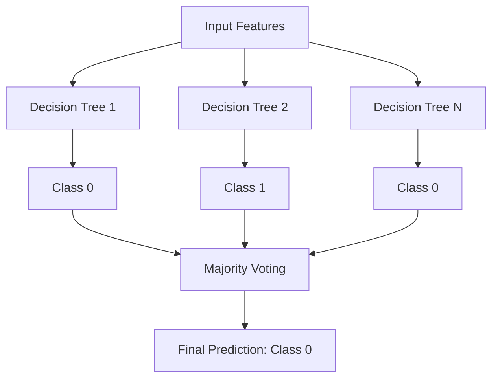
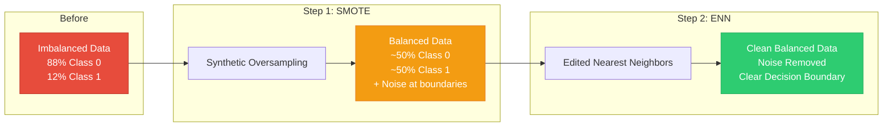
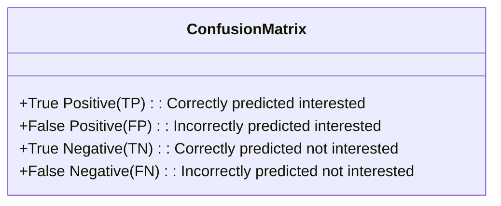
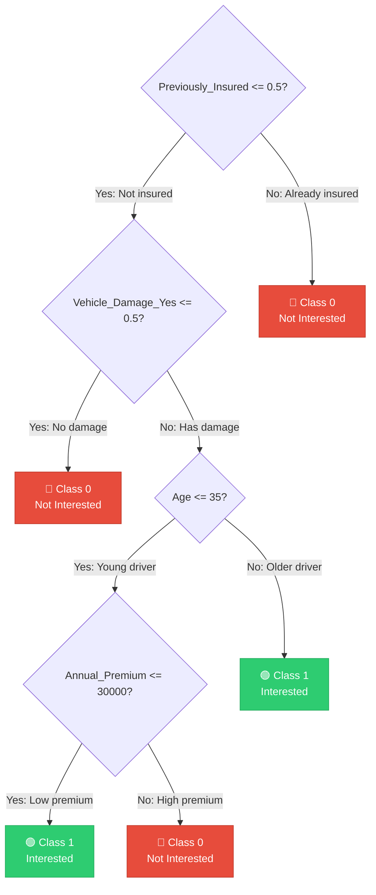

# 09. Machine Learning Concepts

This chapter outlines the core machine learning algorithms, dataset balancing techniques, and evaluation metrics used in this project.

---

## 🌲 1. Random Forest Classifier

The system uses a **Random Forest Classifier** as the core model. Random Forest is an ensemble learning method that builds multiple decision trees during training and outputs the majority vote class for predictions:

### Why Random Forest?
*   **Handles Mixed Data Types**: Easily handles binary, integer, and scaled float columns.
*   **Resistant to Overfitting**: By averaging predictions across trees, it reduces variance compared to individual decision trees.
*   **Non-Linear Boundaries**: Can capture complex, non-linear interactions between variables (such as relations between Age, Vintage, and Previous Insurance status) without manual feature engineering.

### Hyperparameters Configured
*   `n_estimators = 200`: Number of decision trees in the forest. More trees improve stability but increase training time.
*   `max_depth = 10`: Limits tree depth to prevent overfitting.
*   `min_samples_split = 7`: Minimum samples required to split an internal node.
*   `min_samples_leaf = 6`: Minimum samples required at a leaf node, smoothing predictions near boundaries.
*   `criterion = 'entropy'`: Measures split quality based on information gain.

---

## ⚖️ 2. Resolving Class Imbalance (SMOTEENN)

With only 12% positive cases in the raw dataset, a standard classifier will bias towards the majority class (`Response = 0`). The project resolves this by applying **SMOTEENN** (SMOTE + Edited Nearest Neighbors):

### 1. Oversampling (SMOTE)
*   SMOTE (Synthetic Minority Over-sampling Technique) fits a K-Nearest Neighbors model on the minority class (`Response = 1`).
*   It draws a line segment between a minority sample and its nearest neighbors.
*   Synthetic samples are created along these line segments, balancing the representation of both classes.

### 2. Under-sampling & Cleaning (ENN)
*   Oversampling can create noisy, overlapping regions where synthetic class 1 points bleed into class 0 clusters.
*   ENN (Edited Nearest Neighbors) examines the K-Nearest Neighbors of each sample in the dataset.
*   If a sample's class differs from the majority class of its neighbors, it is dropped. This cleans up decision boundaries, making it easier for the Random Forest to identify the class boundary.

### Visual: SMOTEENN Pipeline Flow

---

## 📊 3. Classification Evaluation Metrics

Evaluating an imbalanced dataset requires metrics beyond raw accuracy:

### 1. Precision
Measures the accuracy of positive predictions:
$$\text{Precision} = \frac{\text{TP}}{\text{TP} + \text{FP}}$$
*   *Business Context*: High precision ensures that when the system predicts a customer is interested, they actually are, minimizing wasted outreach resources.

### 2. Recall (Sensitivity)
Measures the proportion of actual positives identified:
$$\text{Recall} = \frac{\text{TP}}{\text{TP} + \text{FN}}$$
*   *Business Context*: High recall ensures that the company doesn't miss potential customers who would have bought insurance.

### 3. F1-Score
The harmonic mean of Precision and Recall:
$$F_1 = 2 \cdot \frac{\text{Precision} \cdot \text{Recall}}{\text{Precision} + \text{Recall}}$$
*   *ML Context*: Provides a single metric to balance Precision and Recall, making it the primary metric for model evaluation.

---

## 🔬 4. Model Experimentation Insights

Reviewing the research findings in `notebook/experiment_notebook.ipynb`:

1.  **Baseline Failure**: Initially, models trained without resampling had high accuracy (87.7%) but an F1-score of **0.00** for the minority class (`Response = 1`). The classifier was predicting `0` for all inputs due to the class imbalance.
2.  **Hyperparameter Tuning**: Hyperparameters were tuned using `RandomizedSearchCV` across a parameter grid (evaluating options for `n_estimators`, `max_depth`, `min_samples_leaf`, and `min_samples_split` over 4-fold cross-validation).
3.  **Tuning Results**: Tuning selected `max_depth = 3` with `n_estimators = 300`. However, limiting the depth to 3 restricted model capacity, leading to poor recall on class 1.
4.  **Production Adjustment**: The production pipeline uses a depth limit of 10 (`max_depth = 10`) combined with SMOTEENN resampling. This balance maintains model stability while improving minority class predictions.

---

## 🌳 5. Decision Tree Split Visualization

Each tree in the Random Forest makes decisions by splitting features at threshold values. Here is a simplified representation of how a single decision tree within the forest might classify a sample:

In a Random Forest with `n_estimators = 200`, 200 such trees are constructed on random subsets of features and data, and the final prediction is determined by majority voting across all trees.
