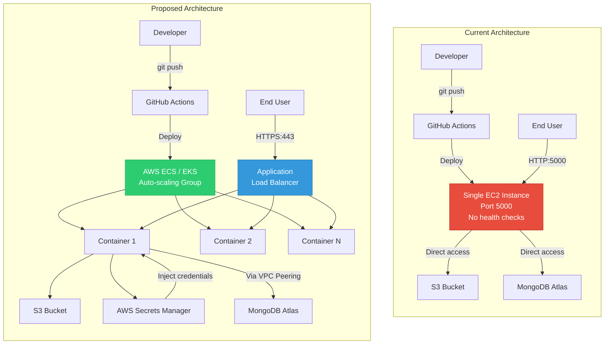

# 11. Production Refactoring & Improvements

This chapter outlines architectural refactoring, security improvements, and bug fixes to prepare the application for a production environment.

---

## 🔒 1. Security Improvements

1.  **FastAPI Endpoint Protection**:
    *   *Current State*: The `/train` and `/` endpoints are open, meaning anyone can trigger model training or query predictions.
    *   *Improvement*: Implement authentication (e.g., JWT tokens or API Keys) to restrict access to authorized users.
2.  **Least Privilege IAM Policies**:
    *   *Current State*: The application uses generic AWS credentials.
    *   *Improvement*: Create a specific IAM Role for the EC2 instance running the app, granting access *only* to the required S3 bucket (`my-model-mlopsproject-bucket`) and ECR repository.
3.  **Secrets Management**:
    *   *Current State*: Credentials like `MONGODB_URL` are passed as plain text environment variables in the CD runner command.
    *   *Improvement*: Use a secrets manager (e.g., AWS Secrets Manager or HashiCorp Vault) to inject credentials into the container at runtime.

---

## ⚡ 2. Performance & Scalability

1.  **FastAPI Lifespan Startup Cache**:
    *   *Current State*: The predictor lazy loads the model on the first request, which can cause latency for the first user.
    *   *Improvement*: Use FastAPI's `lifespan` handler to load the model into memory during server startup:
        ```python
        @asynccontextmanager
        async def lifespan(app: FastAPI):
            # Load model into memory on startup
            app.state.model = VehicleDataClassifier()
            yield
            # Clean up on shutdown
        ```
2.  **Logging Levels**:
    *   *Current State*: The rotating file logger captures `DEBUG` logs in production, which can cause excessive disk writes.
    *   *Improvement*: Set the production logging level to `INFO` or `WARNING` to capture only necessary events.
3.  **Horizontal Auto-Scaling**:
    *   *Current State*: The container is deployed to a single EC2 instance.
    *   *Improvement*: Deploy the container using a container orchestrator (e.g., AWS ECS or EKS) behind an Application Load Balancer (ALB) to handle traffic spikes.

---

## 🐛 3. Critical Bug Fixes

### Bug A: Training Accuracy Evaluation
In `src/components/model_trainer.py`, the model's accuracy check is performed on the **training set**:
```python
if accuracy_score(train_arr[:, -1], trained_model.predict(train_arr[:, :-1])) < self.model_trainer_config.expected_accuracy:
```
*   *Issue*: This can lead to overfitting, as a model can overfit the training data to pass the threshold check while performing poorly on unseen test data.
*   *Refactored Code*: Evaluate accuracy on the validation or test set (`test_arr`):
    ```python
    test_accuracy = accuracy_score(test_arr[:, -1], trained_model.predict(test_arr[:, :-1]))
    if test_accuracy < self.model_trainer_config.expected_accuracy:
        raise Exception("No model found with test score above the base score")
    ```

### Bug B: GitHub Actions CD Port Conflict
The CD deployment job in `.github/workflows/aws.yaml` runs the container without stopping the currently running one:
```yaml
- name: Run Docker Image to serve users
  run: |
   docker run -d ... -p 5000:5000 registry/repository:latest
```
*   *Issue*: Subsequent deployments will fail because port 5000 is already in use by the previous container.
*   *Refactored Code*: Stop and remove the existing container before running the new one:
    ```yaml
    - name: Run Docker Image to serve users
      run: |
       docker stop vehicle_app || true
       docker rm vehicle_app || true
       docker run -d --name vehicle_app -p 5000:5000 ... registry/repository:latest
    ```

### Bug C: JSON Output in YAML File
In `src/components/data_validation.py`, the validation report is written in JSON format but saved with a `.yaml` extension:
```python
with open(self.data_validation_config.validation_report_file_path, "w") as report_file:
    json.dump(validation_report, report_file, indent=4)
```
*   *Issue*: This can cause errors for components expecting YAML formatted files.
*   *Refactored Code*: Save the report as a JSON file or use PyYAML to write the report in YAML format:
    ```python
    import yaml
    with open(self.data_validation_config.validation_report_file_path, "w") as report_file:
        yaml.dump(validation_report, report_file)
    ```

---

## 🏗️ 4. Current vs. Proposed Architecture

The diagram below contrasts the current single-instance architecture with a production-ready scalable design:



### Key Differences

| Aspect | Current | Proposed |
| :--- | :--- | :--- |
| **Scaling** | Single EC2 instance | Auto-scaling container group |
| **Load Balancing** | None | Application Load Balancer (ALB) |
| **SSL/TLS** | None (HTTP) | HTTPS via ALB certificate |
| **Secrets** | Env vars in docker run | AWS Secrets Manager injection |
| **Health Checks** | None | ALB health probes + container liveness |
| **Deployment** | Port conflict risk | Rolling update with zero downtime |
