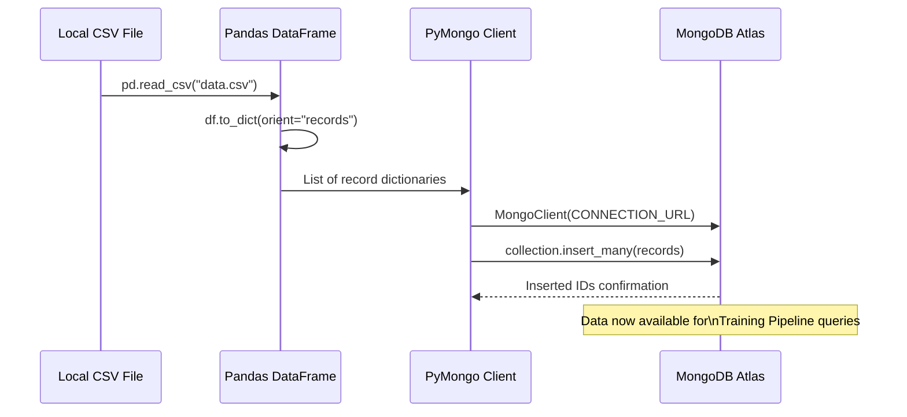

# 13. Appendix & References

This appendix covers auxiliary tools, database seeding scripts, experimental notebook reviews, and external reference links.

---

## 💾 1. Database Seeding Script (`mongoDB_demo.ipynb`)

Before running the training pipeline, the MongoDB database is seeded with raw vehicle data using the script demonstrated in `notebook/mongoDB_demo.ipynb`:

```python
import pandas as pd
import pymongo

# 1. Load the local CSV file
df = pd.read_csv("data.csv")

# 2. Convert the DataFrame to a list of dictionaries (records)
data = df.to_dict(orient="records")

# 3. Establish a connection to the MongoDB cluster
DB_NAME = "Proj1"
COLLECTION_NAME = "Proj1-Data"
CONNECTION_URL = "mongodb+srv://<username>:<password>@cluster0.t5lsxee.mongodb.net/?appName=Cluster0"

client = pymongo.MongoClient(CONNECTION_URL)
data_base = client[DB_NAME]
collection = data_base[COLLECTION_NAME]

# 4. Upload the records to the collection
rec = collection.insert_many(data)
```

---

## 🔬 2. Notebook Experiments & Tuning (`experiment_notebook.ipynb`)

The model development process is documented in `notebook/experiment_notebook.ipynb`:

1.  **Exploratory Data Analysis (EDA)**:
    *   Analyzes class distribution (identifying the 88% to 12% split imbalance).
    *   Plots demographic relationships (such as Age vs. Insurance Interest, and Vehicle Damage vs. Insurance Interest).
2.  **Hyperparameter Search Space**:
    *   Tuning evaluated options for `n_estimators`, `max_depth`, `min_samples_leaf`, and `min_samples_split` over 4-fold cross-validation.
    *   Selected hyperparameters: `{'n_estimators': 300, 'min_samples_split': 7, 'min_samples_leaf': 8, 'max_depth': 3, 'criterion': 'gini'}`.
3.  **Baseline Evaluation**:
    *   Initial evaluations showed high classification accuracy (87.7%) but an F1-score of 0.00 for class 1.
    *   This demonstrated the necessity of using SMOTEENN in production to obtain meaningful predictions.

---

## 📚 3. External References

*   **Scikit-Learn Documentation**:
    *   [Random Forest Classifier](https://scikit-learn.org/stable/modules/generated/sklearn.ensemble.RandomForestClassifier.html)
    *   [Column Transformer](https://scikit-learn.org/stable/modules/generated/sklearn.compose.ColumnTransformer.html)
*   **Imbalanced-Learn Documentation**:
    *   [SMOTEENN Combines Oversampling and Undersampling](https://imbalanced-learn.org/stable/references/generated/imblearn.combine.SMOTEENN.html)
*   **Boto3 Documentation**:
    *   [Boto3 S3 Client Quickstart](https://boto3.amazonaws.com/v1/documentation/api/latest/guide/s3-example-creating-buckets.html)
*   **MongoDB PyMongo Documentation**:
    *   [PyMongo Tutorial](https://pymongo.readthedocs.io/en/stable/tutorial.html)

---

## 🔄 4. Database Seeding Flow

The following diagram illustrates the one-time data seeding process from a local CSV file to MongoDB Atlas:



## 🧪 5. Experiment Notebook Workflow

The model experimentation workflow in the Jupyter notebook follows this process:

```mermaid
flowchart LR
    subgraph "EDA Phase"
        Load["Load CSV"] --> Explore["Analyze Distributions"]
        Explore --> Imbalance["Identify 88/12 Imbalance"]
    end

    subgraph "Baseline Phase"
        Imbalance --> NaiveRF["Train RF Without Resampling"]
        NaiveRF --> Eval1["Accuracy: 87.7%\nF1 Class 1: 0.00"]
        Eval1 --> Insight["⚠️ Model predicts\nall zeros"]
    end

    subgraph "Tuning Phase"
        Insight --> GridSearch["RandomizedSearchCV\n4-fold CV"]
        GridSearch --> BestParams["Best: n_est=300\nmax_depth=3"]
    end

    subgraph "Production Decision"
        BestParams --> Adjust["Adjust for production:\nmax_depth=10\n+ SMOTEENN"]
        Adjust --> Final["Production Config\nin constants/__init__.py"]
    end

    style Eval1 fill:#e74c3c,stroke:#c0392b,color:#fff
    style Final fill:#2ecc71,stroke:#27ae60,color:#fff
```


