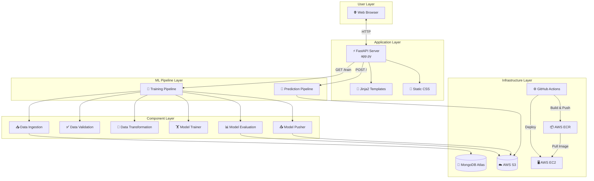

# Vehicle Insurance MLOps Project Documentation

Welcome to the official internal engineering documentation for the **Vehicle Insurance MLOps System**. This repository contains a comprehensive guide designed for onboarding new engineers, preparing for technical interviews, and serving as a reference for architecture, deployment, and code walkthroughs.

---

## 📚 Table of Contents

### 1. [01_Project_Overview.md](file:///c:/Projects/Vehicle-Insurance/Documentation/01_Project_Overview.md)
*   Business Goal & Objectives
*   Dataset Feature Specifications
*   Target Variable definition
*   Key MLOps and Machine Learning challenges

### 2. [02_System_Architecture.md](file:///c:/Projects/Vehicle-Insurance/Documentation/02_System_Architecture.md)
*   High-level System Architecture
*   Mermaid Flowcharts (Architecture, Training, Prediction, CI/CD)
*   AWS and MongoDB Atlas Cloud Integration details

### 3. [03_Folder_Structure.md](file:///c:/Projects/Vehicle-Insurance/Documentation/03_Folder_Structure.md)
*   Directory tree layout of the workspace
*   Explanation of all subfolders and their purpose

### 4. [04_Execution_Flow.md](file:///c:/Projects/Vehicle-Insurance/Documentation/04_Execution_Flow.md)
*   Step-by-step walkthrough of starting the server
*   Training execution lifecycle
*   Prediction inference lifecycle

### 5. [05_Data_Flow.md](file:///c:/Projects/Vehicle-Insurance/Documentation/05_Data_Flow.md)
*   Raw Data format from MongoDB
*   Pre-modeling transformations (Gender mapping, Dummy variables, Renaming)
*   Pipelines (StandardScaler, MinMaxScaler, SMOTEENN resampling)
*   Final array mapping for RandomForestClassifier

### 6. [06_Source_Code/](file:///c:/Projects/Vehicle-Insurance/Documentation/06_Source_Code/)
Exhaustive line-by-line code walk-throughs across files:
*   [01_infrastructure.md](file:///c:/Projects/Vehicle-Insurance/Documentation/06_Source_Code/01_infrastructure.md) - Logger, Exceptions, and Utilities
*   [02_connections.md](file:///c:/Projects/Vehicle-Insurance/Documentation/06_Source_Code/02_connections.md) - MongoDB and AWS Client Storage
*   [03_data_pipeline.md](file:///c:/Projects/Vehicle-Insurance/Documentation/06_Source_Code/03_data_pipeline.md) - Ingestion, Validation, and Transformation Components
*   [04_model_pipeline.md](file:///c:/Projects/Vehicle-Insurance/Documentation/06_Source_Code/04_model_pipeline.md) - Training, Evaluation, and Pusher Components
*   [05_orchestration_and_app.md](file:///c:/Projects/Vehicle-Insurance/Documentation/06_Source_Code/05_orchestration_and_app.md) - Pipelines (`TrainPipeline`, `prediction_pipeline`), FastAPI `app.py`, `demo.py`, `template.py`

### 7. [07_Configuration/](file:///c:/Projects/Vehicle-Insurance/Documentation/07_Configuration/)
*   [config_walkthrough.md](file:///c:/Projects/Vehicle-Insurance/Documentation/07_Configuration/config_walkthrough.md) - Constants, Schema file configurations, Config and Artifact Entities.

### 8. [08_Deployment/](file:///c:/Projects/Vehicle-Insurance/Documentation/08_Deployment/)
*   [deployment_walkthrough.md](file:///c:/Projects/Vehicle-Insurance/Documentation/08_Deployment/deployment_walkthrough.md) - Docker configs, GitHub Actions CD pipelines, EC2 infrastructure configurations.

### 9. [09_Machine_Learning/](file:///c:/Projects/Vehicle-Insurance/Documentation/09_Machine_Learning/)
*   [concepts.md](file:///c:/Projects/Vehicle-Insurance/Documentation/09_Machine_Learning/concepts.md) - RandomForestClassifier internals, imbalanced dataset algorithms (SMOTEENN), hyperparameter search, and EDA results.

### 10. [10_Interview_Preparation/](file:///c:/Projects/Vehicle-Insurance/Documentation/10_Interview_Preparation/)
*   [questions.md](file:///c:/Projects/Vehicle-Insurance/Documentation/10_Interview_Preparation/questions.md) - Comprehensive interview questions categorized from Beginner to Senior/Staff levels.

### 11. [11_Refactoring/](file:///c:/Projects/Vehicle-Insurance/Documentation/11_Refactoring/)
*   [improvements.md](file:///c:/Projects/Vehicle-Insurance/Documentation/11_Refactoring/improvements.md) - Production improvements (Security, Performance, Scalability, and Code Bugs).

### 12. [12_Glossary/](file:///c:/Projects/Vehicle-Insurance/Documentation/12_Glossary/)
*   [terms.md](file:///c:/Projects/Vehicle-Insurance/Documentation/12_Glossary/terms.md) - Detailed definitions of all terms used (e.g., SMOTEENN, ColumnTransformer, Serialization).

### 13. [13_Appendix/](file:///c:/Projects/Vehicle-Insurance/Documentation/13_Appendix/)
*   [reference.md](file:///c:/Projects/Vehicle-Insurance/Documentation/13_Appendix/reference.md) - MongoDB upload scripts, experimental Jupyter notebooks review, License.

---

## 🛠️ How to read this book

For onboarding developers:
1. Start with the **Project Overview** and **System Architecture** chapters to understand the context.
2. Read the **Folder Structure** and **Execution Flow** chapters to orient yourself with the workspace.
3. Dive into the **Source Code Walkthrough** for the specific component you are working on.
4. Utilize the **Glossary** and **Machine Learning** chapters to resolve concepts.
5. Practice using the **Interview Preparation** chapters to test your mastery of the codebase.

---

## 🏗️ Quick Architecture Overview

