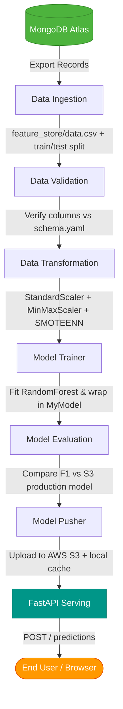
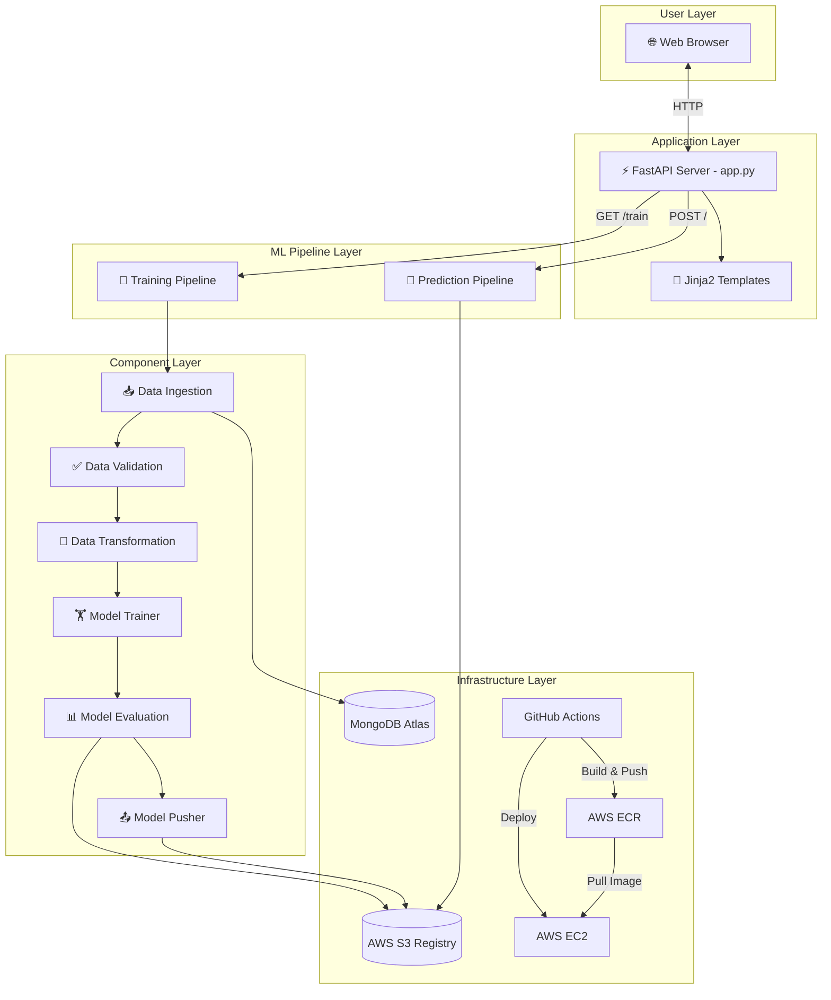

# 01. High-Level Project Overview & Business System Architecture

This section provides a 30,000-foot view of the **Vehicle Insurance Cross-Sell Prediction** MLOps project. It explains the core business problem, input/output data contracts, high-level execution flow, user/system personas, and architectural boundaries.

---

## 1. Core Business Problem & Objective

Insurance companies incur substantial operational and marketing costs when conducting customer outreach for cross-selling policy products (such as vehicle insurance to existing health insurance policyholders). Contacting every lead indiscriminately results in low conversion rates and inflated campaign costs.

The goal of this project is to build an automated, end-to-end MLOps pipeline and web service that predicts whether an existing customer will be interested in purchasing **Vehicle Insurance** (`Response = 1` vs `Response = 0`). 

By deploying a trained model as a RESTful web application, marketing teams and automated sales systems can score leads in real time, focusing outreach efforts exclusively on high-probability conversions.

---

## 2. Input / Output Data Contract

### Input Features (`VehicleData` schema):
*   **`Gender`**: Customer gender (`"Male"`, `"Female"` or pre-mapped `1`, `0`).
*   **`Age`**: Customer age in years (integer, e.g., `44`).
*   **`Driving_License`**: Possession of a valid driving license (`1` = Has License, `0` = No License).
*   **`Region_Code`**: Anonymized numeric code for the customer's region (float/integer, e.g., `28.0`).
*   **`Previously_Insured`**: Whether the customer already has vehicle insurance (`1` = Yes, `0` = No).
*   **`Vehicle_Age`**: Age of the vehicle (`"< 1 Year"`, `"1-2 Year"`, `"> 2 Years"` or encoded dummies `Vehicle_Age_lt_1_Year`, `Vehicle_Age_gt_2_Years`).
*   **`Vehicle_Damage`**: Past vehicle damage history (`"Yes"`, `"No"` or encoded `Vehicle_Damage_Yes`).
*   **`Annual_Premium`**: Amount the customer pays annually in premiums (float, e.g., `40454.0`).
*   **`Policy_Sales_Channel`**: Anonymized code for outreach channel (float/integer, e.g., `26.0`).
*   **`Vintage`**: Number of days the customer has been associated with the company (integer, e.g., `217`).

### Output Target:
*   **`Response`**: Binary classification output.
    *   `1` (Rendered as **`Response-Yes`**): Customer is interested in Vehicle Insurance.
    *   `0` (Rendered as **`Response-No`**): Customer is not interested.

---

## 3. System Personas & Consumers

1.  **End Users / Sales Agents**: Interact with the web interface served by `app.py` at `/` to submit individual customer details via an interactive HTML form (`vehicledata.html`) and view instant predictions.
2.  **MLOps / Data Engineers**: Trigger automated retraining pipelines on demand via the HTTP GET `/train` endpoint or locally via `demo.py`.
3.  **Automated CI/CD System (GitHub Actions)**: Listens for main branch code pushes, builds isolated Docker images, pushes them to AWS ECR, and deploys the container to an AWS EC2 instance.

---

## 4. End-to-End High-Level Flow

1.  **Data Fetching**: Raw records are ingested dynamically from MongoDB Atlas (`Proj1-Data` collection).
2.  **Validation**: Schema parameters (`config/schema.yaml`) are checked to guarantee structural integrity.
3.  **Transformation**: Feature engineering converts categorical values, applies `StandardScaler` to `Age` & `Vintage`, `MinMaxScaler` to `Annual_Premium`, and balances minority response targets using **SMOTEENN**.
4.  **Training**: A `RandomForestClassifier` is trained, wrapped with its preprocessor inside a `MyModel` object, and evaluated on accuracy thresholds.
5.  **Evaluation & Production Push**: The newly trained candidate model is compared against the active production model stored in an **AWS S3 bucket**. If the candidate improves F1-score by $\ge 0.02$, it is pushed to AWS S3.
6.  **Serving & Inference**: A **FastAPI** web server (`app.py`) loads the model (`Proj1Estimator`) to evaluate incoming web requests and render UI results.

---

## 5. System Architecture Diagram

