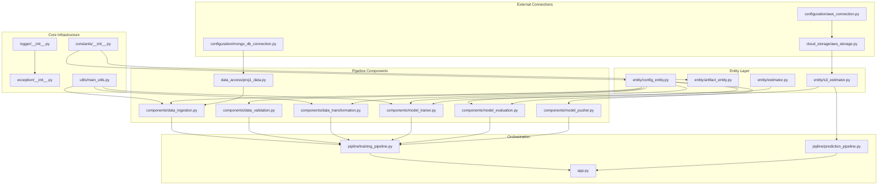

# 02. Repository Structure & File Map

This section provides a complete, exhaustive directory tree and file map of the codebase. Every folder and file is documented with its single-line responsibility and category.

---

## 📂 Repository File Tree

```text
Vehicle-Insurance/
├── .dockerignore                     # Excludes temporary files, venv, logs, and artifacts from Docker builds
├── .gitignore                        # Excludes local artifacts, models, venv, and cache files from Git tracking
├── Dockerfile                        # Python 3.10 deployment containerization instructions
├── LICENSE                           # Project open-source license specification
├── README.md                         # Top-level project summary and quickstart guide
├── app.py                            # FastAPI web server exposing prediction form and /train endpoint
├── demo.py                           # Development CLI runner script to trigger TrainPipeline locally
├── practice_ulr.py                   # Temporary testing sandbox script
├── pyproject.toml                    # Modern PEP 517 build backend definitions (setuptools integration)
├── requirements.txt                  # Python dependencies list (includes `-e .` for local package editable install)
├── setup.py                          # Legacy/Standard setuptools packaging configuration
├── template.py                       # Automated project boilerplate generator script
├── workflow.txt                      # Developer notes outlining step-by-step code construction sequence
│
├── .github/
│   └── workflows/
│       └── aws.yaml                  # GitHub Actions CI/CD workflow (ECR image build & EC2 runner deployment)
│
├── config/
│   ├── model.yaml                    # Placeholder configuration file for hyperparameters
│   └── schema.yaml                   # Central data schema specifying column names, types, and scaling targets
│
├── notebook/
│   ├── data.csv                      # Sample offline dataset used for initial EDA and seeding
│   ├── experiment_notebook.ipynb     # Jupyter notebook with EDA, SMOTE experiments, and grid searches
│   ├── mongoDB_demo.ipynb            # Jupyter notebook demonstrating MongoDB connection and CSV upload
│   └── rf_model.pkl                  # Serialized reference model output from Jupyter experimentation
│
├── static/
│   └── css/
│       └── style.css                 # Custom styling stylesheet for the HTML web prediction interface
│
├── templates/
│   └── vehicledata.html              # Jinja2 HTML template rendering the user input form and prediction result
│
└── src/                              # Main Python application package (`src`)
    ├── __init__.py                   # Marks src as a top-level Python package
    │
    ├── cloud_storage/
    │   ├── __init__.py               # Package marker for cloud storage module
    │   └── aws_storage.py            # SimpleStorageService wrapper handling low-level S3 upload/download/sync operations
    │
    ├── components/
    │   ├── __init__.py               # Package marker for components module
    │   ├── data_ingestion.py         # Component 1: Connects to MongoDB Atlas, exports feature store CSV, splits train/test
    │   ├── data_validation.py        # Component 2: Checks data column counts and data types against schema.yaml
    │   ├── data_transformation.py    # Component 3: Performs dummy encoding, ColumnTransformer scaling, & SMOTEENN resampling
    │   ├── model_trainer.py          # Component 4: Trains RandomForest, verifies accuracy threshold, bundles into MyModel
    │   ├── model_evaluation.py       # Component 5: Downloads S3 production model, evaluates F1 scores, determines acceptance
    │   └── model_pusher.py           # Component 6: Uploads accepted candidate model to AWS S3 bucket and updates local cache
    │
    ├── configuration/
    │   ├── __init__.py               # Package marker for configuration module
    │   ├── aws_connection.py         # S3Client singleton managing boto3 session credentials and region connection
    │   └── mongo_db_connection.py    # MongoDBClient singleton establishing TLS-secured PyMongo connection to Atlas
    │
    ├── constants/
    │   └── __init__.py               # Global project constants (DB names, S3 bucket names, threshold parameters, file paths)
    │
    ├── data_access/
    │   ├── __init__.py               # Package marker for data access module
    │   └── proj1_data.py             # Proj1Data class converting MongoDB Atlas query collections into Pandas DataFrames
    │
    ├── entity/
    │   ├── __init__.py               # Package marker for entity module
    │   ├── artifact_entity.py        # Dataclasses defining structural outputs passed between pipeline components
    │   ├── config_entity.py          # Dataclasses defining configuration parameters, file paths, and run timestamps
    │   ├── estimator.py              # MyModel wrapper bundling ColumnTransformer preprocessing object and fitted classifier
    │   └── s3_estimator.py           # Proj1Estimator wrapper managing remote S3 model fetching, caching, and inference
    │
    ├── exception/
    │   └── __init__.py               # Custom MyException handler capturing file names and line numbers via sys.exc_info()
    │
    ├── logger/
    │   └── __init__.py               # Module-level logging setup creating rotating file handlers in logs/<timestamp>.log
    │
    ├── pipline/                      # Core orchestration module (spelled `pipline` in codebase)
    │   ├── __init__.py               # Package marker for pipeline module
    │   ├── prediction_pipeline.py    # VehicleData & VehicleDataClassifier handling web form parsing & prediction inference
    │   └── training_pipeline.py      # TrainPipeline orchestrating execution of all 6 components sequentially
    │
    └── utils/
        ├── __init__.py               # Package marker for utils module
        └── main_utils.py             # MainUtils helper functions for YAML IO, dill pickle IO, and NumPy array file IO
```

---

## 🏷️ Submodule Functional Breakdown

*   **`src/components`**: Contains the core domain logic for each step of model lifecycle execution. Components take `config_entity` parameters as input and return `artifact_entity` outputs.
*   **`src/entity`**: Contains data contracts. `config_entity` specifies *where* and *how* steps should execute, while `artifact_entity` tracks *what* each step produced.
*   **`src/configuration`**: Isolates raw connection setup for external cloud services (AWS S3 via boto3, MongoDB via PyMongo).
*   **`src/cloud_storage`**: High-level wrapper abstraction over boto3 S3 operations (bucket sync, object read/write, bytes streaming).
*   **`src/data_access`**: Converts database connection handles into clean Pandas DataFrames ready for ingestion.
*   **`src/pipline`**: Top-level entry points for training execution (`training_pipeline.py`) and single-sample web inference (`prediction_pipeline.py`).

---

## 🔗 Module Dependency Graph



This graph reveals the layered architecture: core utilities at the bottom, entity definitions bridging configuration and components, and the orchestration layer at the top.
