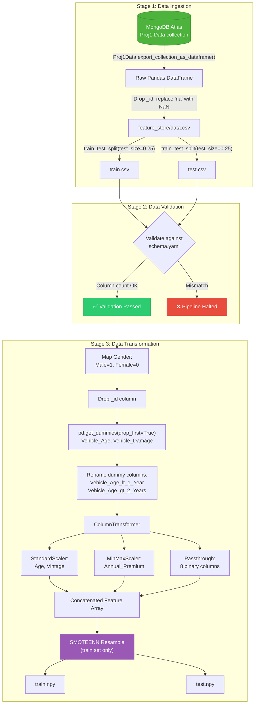
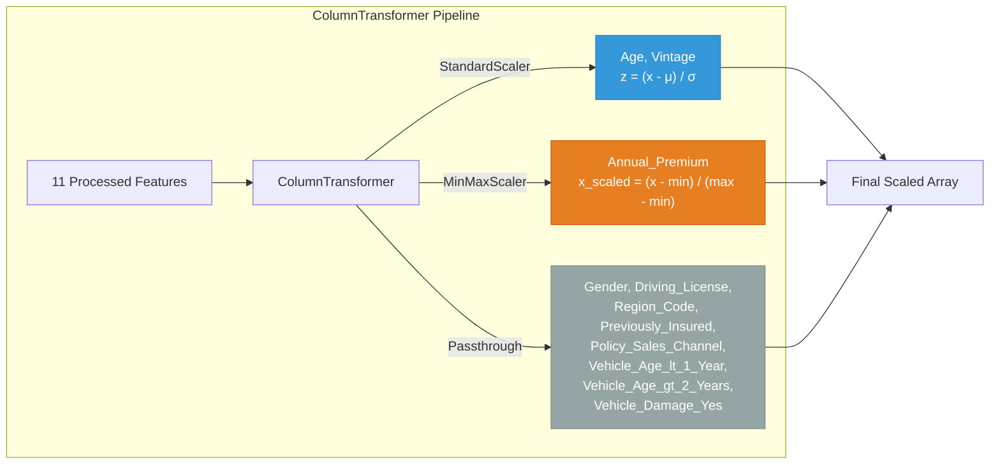
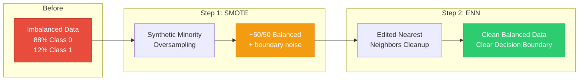

# 03. Data Layer: Ingestion, Validation, and Preprocessing

This section covers every file involved in querying raw database records, validating dataset schema constraints, scaling features, and resolving class imbalance.

---

## 1. `config/schema.yaml`

### 1. What it does
Plain language: A configuration text file that acts as the single source of truth for what our dataset columns look like.
Technical detail: Defines lists of raw columns, numerical columns, categorical columns, drop columns, numerical features to be standardized (`num_features`), and premium columns to be normalized (`mm_columns`).

### 2. Why it exists / What problem it solves
Prevents hardcoding column names and data types inside Python component files. If the dataset schema changes in the future, developers only edit this YAML file rather than modifying Python code across multiple components.

### 3. What would break if it didn't exist
Data validation (`data_validation.py`) and data transformation (`data_transformation.py`) would fail with `FileNotFoundError` or key errors because they read `schema.yaml` to dynamically know which columns to validate, drop, or scale.

### 4. Component Communications & Connections
*   **Reads Config**: Read by `read_yaml_file()` in `src/utils/main_utils.py`.
*   **Called By**: `DataValidation` (via `self._schema_config`) and `DataTransformation` (via `self._schema_config`).
*   **Outputs Data To**: Dictionary passed to `validate_number_of_columns()` and column selectors.

### 5. Design Decisions & Tradeoffs
*   *Decision*: Explicitly separate `num_features` (`Age`, `Vintage`) and `mm_columns` (`Annual_Premium`) in YAML.
*   *Tradeoff*: Hardcoding transformations per column group in code is faster to write initially, but YAML separation makes scaling choices configurable without code deployments.

### 6. Interview Pitch
> "I centralize our data schema definitions inside `config/schema.yaml`. This acts as our data contract: data validation reads it to verify column counts and types, while transformation components read it to decide which columns get standardized vs normalized. It completely decouples our business logic from column-name hardcoding."

---

## 2. `src/configuration/mongo_db_connection.py`

### 1. What it does
Plain language: Connects our Python application safely to our remote cloud database (MongoDB Atlas).
Technical detail: Defines the `MongoDBClient` class which implements the Singleton pattern. Reads `MONGODB_URL` from environment variables, uses `certifi.where()` to handle SSL/TLS certificate verification, and initializes a `pymongo.MongoClient` instance connected to the `Proj1` database.

### 2. Why it exists / What problem it solves
Database connections are expensive to open and close. Without this module, every pipeline component querying MongoDB would open a new TCP connection, exhausting database connection pools and slowing down ingestion.

### 3. What would break if it didn't exist
`src/data_access/proj1_data.py` could not establish a connection to MongoDB Atlas, making data ingestion impossible.

### 4. Component Communications & Connections
*   **Imports**: `pymongo`, `certifi`, `os`, `sys`, `src.constants.DATABASE_NAME`, `src.constants.MONGODB_URL_KEY`, `src.exception.MyException`, `src.logger.logging`.
*   **Talks To**: Reads OS environment variable `MONGODB_URL`. Connects to external MongoDB Atlas cluster.
*   **Called By**: `Proj1Data.export_collection_as_dataframe()` in `src/data_access/proj1_data.py`.

### 5. Design Decisions & Tradeoffs
*   *Decision*: Singleton pattern (`MongoDBClient.client` class variable).
*   *Tradeoff*: Ensures only one database client connection pool exists across the application runtime, saving network overhead. However, it requires thread safety awareness if used in multi-threaded asynchronous writes (though here we only perform batch reads).

### 6. Interview Pitch
> "I implemented a Singleton `MongoDBClient` class that initializes a PyMongo connection to our MongoDB Atlas cluster using secure TLS certificates via `certifi`. It reads credentials from environment variables and reuses the connection instance across the application lifecycle to avoid network connection overhead."

---

## 3. `src/data_access/proj1_data.py`

### 1. What it does
Plain language: Pulls data out of MongoDB and converts it into a clean Pandas DataFrame.
Technical detail: Defines the `Proj1Data` class. Its method `export_collection_as_dataframe()` connects to MongoDB Atlas using `MongoDBClient`, queries all documents in the specified collection (`Proj1-Data`), converts them to a DataFrame, drops the automatically generated MongoDB `_id` field, and replaces string `"na"` placeholders with `np.nan`.

### 2. Why it exists / What problem it solves
Isolates database querying logic from pipeline orchestration logic. Data ingestion doesn't need to know *how* to query PyMongo; it simply calls `Proj1Data.export_collection_as_dataframe()`.

### 3. What would break if it didn't exist
`DataIngestion` component (`data_ingestion.py`) would have to write raw database queries directly, violating the Single Responsibility Principle.

### 4. Component Communications & Connections
*   **Imports**: `sys`, `pandas`, `numpy`, `src.configuration.mongo_db_connection.MongoDBClient`, `src.exception.MyException`.
*   **Called By**: `DataIngestion.export_data_into_feature_store()` in `src/components/data_ingestion.py`.
*   **Data Passed**: Converts PyMongo cursor dictionary records into a `pd.DataFrame`.

### 5. Design Decisions & Tradeoffs
*   *Decision*: Convert MongoDB cursor directly to Pandas DataFrame in memory.
*   *Tradeoff*: Simple and fast for datasets fitting in RAM (such as this ~380k row dataset). For multi-gigabyte datasets, chunking or distributed reads via PySpark would be preferred.

### 6. Interview Pitch
> "`Proj1Data` serves as our Data Access Object layer. It abstracts database interaction by fetching raw MongoDB collections, cleaning initial database artifact fields like `_id` and string `"na"` values, and returning a clean Pandas DataFrame directly to our Data Ingestion component."

---

## 4. `src/components/data_ingestion.py`

### 1. What it does
Plain language: Downloads the raw dataset from MongoDB, saves a raw copy, splits it into train and test files, and returns their file locations.
Technical detail: Defines `DataIngestion` class initialized with `DataIngestionConfig`. Executes `initiate_data_ingestion()`:
1. Calls `export_data_into_feature_store()` to query MongoDB via `Proj1Data` and save to `feature_store/data.csv`.
2. Calls `split_data_as_train_test()` using `train_test_split(df, test_size=0.25, random_state=41)`.
3. Saves `train.csv` and `test.csv` to disk and returns a `DataIngestionArtifact(trained_file_path, test_file_path)`.

### 2. Why it exists / What problem it solves
Creates a reproducible data snapshot on disk (`feature_store/data.csv`) and creates isolated, deterministic train/test splits so downstream training and evaluation always evaluate on identical test samples.

### 3. What would break if it didn't exist
The pipeline would have no training or testing data files, halting the entire training pipeline at stage 1.

### 4. Component Communications & Connections
*   **Reads Config**: `DataIngestionConfig` (from `src/entity/config_entity.py`).
*   **Calls**: `Proj1Data.export_collection_as_dataframe()`, `train_test_split()`.
*   **Called By**: `TrainPipeline.start_data_ingestion()` in `src/pipline/training_pipeline.py`.
*   **Returns Artifact**: `DataIngestionArtifact` (to `src/entity/artifact_entity.py`).

### 5. Design Decisions & Tradeoffs
*   *Decision*: Save a raw copy in `feature_store/data.csv` before splitting.
*   *Tradeoff*: Uses extra disk space, but provides auditability — engineers can inspect the exact snapshot pulled from the database for a specific pipeline run timestamp.

### 6. Interview Pitch
> "The Data Ingestion component orchestrates data extraction from MongoDB Atlas, persists an immutable raw feature store CSV for auditability, performs a stratified 75/25 train-test split, and outputs a `DataIngestionArtifact` containing the file paths for downstream stages."

---

## 5. `src/components/data_validation.py`

### 1. What it does
Plain language: Checks whether incoming dataset files match our required column rules before we waste compute on training.
Technical detail: Defines `DataValidation` class initialized with `DataValidationConfig` and `DataIngestionArtifact`. Reads `config/schema.yaml`. Checks:
1. Number of columns in `train.csv` and `test.csv` against `schema.yaml`.
2. Whether all required columns exist.
3. Saves a validation report (`report.yaml`) and returns `DataValidationArtifact(validation_status, message, report_file_path)`.

### 2. Why it exists / What problem it solves
Prevents "garbage in, garbage out" and silent pipeline crashes. If a database schema update drops a column or alters data structure, validation fails early with an explicit message.

### 3. What would break if it didn't exist
Invalid or corrupted datasets would pass directly into transformation and model training, resulting in cryptic matrix math errors deep inside scikit-learn.

### 4. Component Communications & Connections
*   **Reads Config**: `DataValidationConfig`, `schema.yaml` via `read_yaml_file()`.
*   **Reads Data**: `train.csv` and `test.csv` paths from `DataIngestionArtifact`.
*   **Called By**: `TrainPipeline.start_data_validation()`.
*   **Returns Artifact**: `DataValidationArtifact`.

### 5. Design Decisions & Tradeoffs
*   *Decision*: Halts execution immediately if `validation_status == False`.
*   *Tradeoff*: Strict enforcement guarantees pipeline safety, but requires schema YAML updates whenever intentional feature schema modifications occur.

### 6. Interview Pitch
> "Our Data Validation component acts as a quality gate. It verifies column counts and required field presence in both train and test splits against `schema.yaml`. If validation fails, it generates a report and halts the pipeline before any compute is spent on transformation or model fitting."

---

## 6. `src/components/data_transformation.py`

### 1. What it does
Plain language: Converts raw text and numbers into clean, scaled numeric arrays and fixes severe class imbalance using SMOTEENN.
Technical detail: Defines `DataTransformation` class. Takes `DataIngestionArtifact` and `DataValidationArtifact`.
1. Maps `Gender` (`Male` -> 1, `Female` -> 0).
2. Generates dummy variables for `Vehicle_Age` and `Vehicle_Damage` via `pd.get_dummies(drop_first=True)`.
3. Constructs a scikit-learn `ColumnTransformer` applying `StandardScaler` to `Age` & `Vintage`, and `MinMaxScaler` to `Annual_Premium`.
4. Fits transformer on training data and transforms both train and test sets.
5. Applies **SMOTEENN** (`imblearn.combine.SMOTEENN`) to resample the training set, balancing the minority `Response = 1` class.
6. Saves `preprocessing.pkl`, `train.npy`, `test.npy` and returns `DataTransformationArtifact`.

### 2. Why it exists / What problem it solves
Continuous features have vastly different scales (e.g., `Age` 20-80 vs `Annual_Premium` $2,000-$500,000), which distorts distance metrics. Furthermore, the dataset suffers from severe class imbalance (~88% `0` vs ~12% `1`). Without SMOTEENN, models predict all zeros and achieve 88% accuracy with 0.0 recall.

### 3. What would break if it didn't exist
The Random Forest model would train on raw unscaled features with extreme class imbalance, resulting in a useless baseline model that never identifies interested insurance leads.

### 4. Component Communications & Connections
*   **Reads Config**: `DataTransformationConfig`, `schema.yaml`.
*   **Reads Input Artifact**: `DataIngestionArtifact`.
*   **Uses Helpers**: `save_object()` (to save `preprocessing.pkl`) and `save_numpy_array_data()` (for `.npy` arrays) from `src/utils/main_utils.py`.
*   **Called By**: `TrainPipeline.start_data_transformation()`.
*   **Returns Artifact**: `DataTransformationArtifact`.

### 5. Design Decisions & Tradeoffs
*   *Decision*: Use **SMOTEENN** (SMOTE oversampling + Edited Nearest Neighbors undersampling) instead of standard random oversampling.
*   *Tradeoff*: SMOTE generates synthetic minority samples while ENN removes noisy samples near class boundaries. This yields cleaner decision boundaries than random oversampling, though it increases preprocessing computation time.

### 6. Interview Pitch
> "Data Transformation handles feature encoding, custom scaling, and class balancing. We build a scikit-learn `ColumnTransformer` that standardizes `Age` and `Vintage` while normalizing `Annual_Premium`. To handle our 88-12 class imbalance, we fit **SMOTEENN** on the training set to synthesize minority samples and clean noisy boundary data before model fitting."

---

## Data Layer Flow Diagram

The following diagram shows the complete data flow from raw database records to balanced training arrays:

## Scaling Strategy Breakdown

## SMOTEENN Class Balancing Visualization

