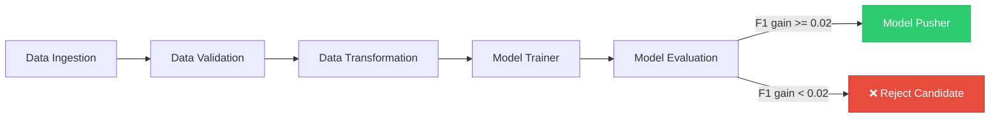
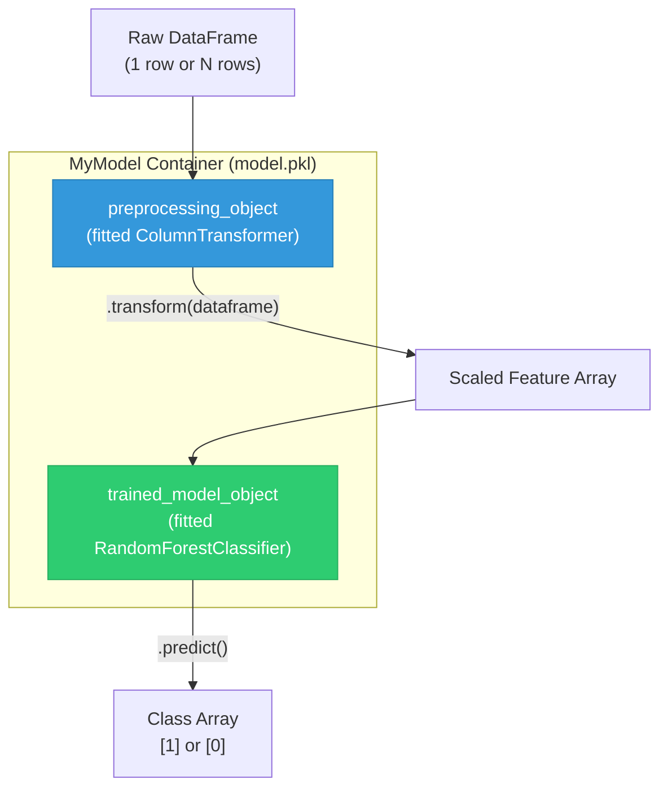
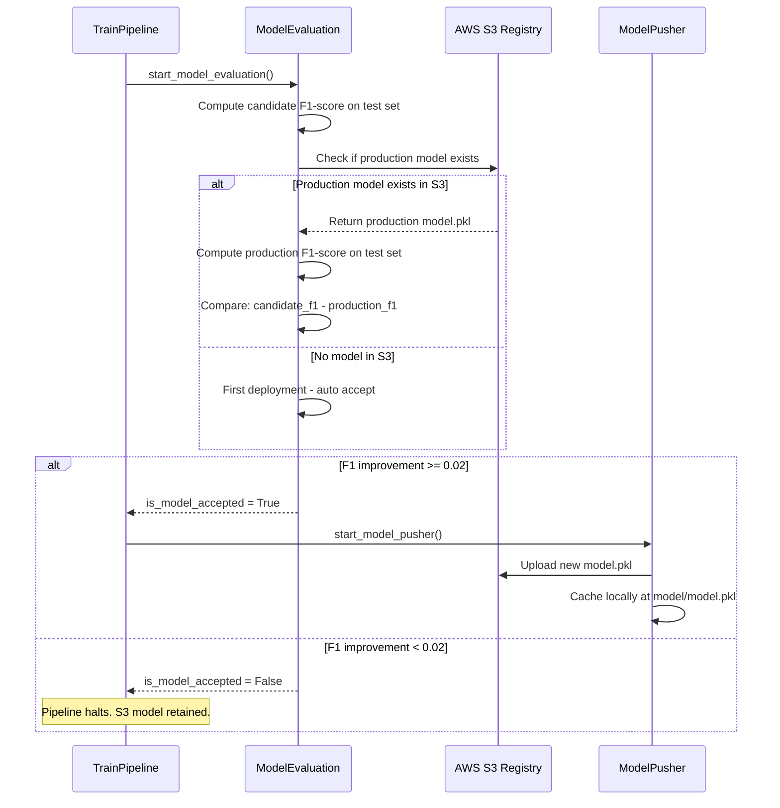

# 04. Training Layer: Model Training, Evaluation, and Packaging

This section details the components responsible for model fitting, metric evaluation, production comparison against AWS S3 registry models, and model object encapsulation.

---

## 1. `src/entity/estimator.py` (`MyModel` Class)

### 1. What it does
Plain language: A wrapper container object that binds the trained machine learning model and the fitted preprocessor together into one single entity.
Technical detail: Defines `MyModel` class with attributes `preprocessing_object` and `trained_model_object`. Exposes a unified `predict(dataframe)` method that first transforms raw input features using `preprocessing_object.transform(dataframe)` and then passes the scaled array to `trained_model_object.predict()`.

### 2. Why it exists / What problem it solves
Solves **train-test skew and inference feature mismatch**. If preprocessor and classifier are saved as separate files, serving code must manually invoke preprocessing step-by-step before calling predict. `MyModel` guarantees that any raw DataFrame passed to `predict()` undergoes identical transformation steps.

### 3. What would break if it didn't exist
The prediction pipeline (`prediction_pipeline.py`) would have to manually load `preprocessing.pkl` and `model.pkl` separately, track column order manually, and risk applying mismatched feature transformations during web inference.

### 4. Component Communications & Connections
*   **Encapsulates**: Preprocessing `ColumnTransformer` + `RandomForestClassifier`.
*   **Instantiated By**: `ModelTrainer.initiate_model_trainer()` in `src/components/model_trainer.py`.
*   **Saved/Loaded By**: `save_object()` / `load_object()` in `src/utils/main_utils.py` and `src/cloud_storage/aws_storage.py`.
*   **Called By**: `Proj1Estimator.predict()` in `src/entity/s3_estimator.py`.

### 5. Design Decisions & Tradeoffs
*   *Decision*: Custom `MyModel` wrapper class instead of scikit-learn `Pipeline`.
*   *Tradeoff*: `Pipeline` requires all steps to follow the scikit-learn API contract strictly. `MyModel` gives full control over custom pandas manipulations (like dummy column creation) alongside scikit-learn transformers.

### 6. Interview Pitch
> "`MyModel` is a custom wrapper class that bundles our fitted `ColumnTransformer` and trained `RandomForestClassifier` into a single serializable object. Calling `.predict()` on `MyModel` automatically runs feature scaling before running classification, eliminating train-serve feature mismatch during deployment."

---

## 2. `src/components/model_trainer.py`

### 1. What it does
Plain language: Trains the Random Forest algorithm on transformed data, checks if accuracy meets our quality bar, and saves the trained model.
Technical detail: Defines `ModelTrainer` class initialized with `ModelTrainerConfig` and `DataTransformationArtifact`.
1. Loads `train.npy` and `test.npy` arrays created by `DataTransformation`.
2. Instantiates `RandomForestClassifier` with hyperparameters specified in `ModelTrainerConfig` (`n_estimators=200`, `min_samples_split=7`, `min_samples_leaf=6`, `random_state=101`).
3. Fits the model on `X_train` and `y_train`.
4. Evaluates accuracy metric score. If accuracy $< 0.60$ (threshold configured in `expected_accuracy`), raises an exception.
5. Calculates classification metrics (`f1_score`, `precision_score`, `recall_score`) on test data using `metric_artifact`.
6. Wraps preprocessor and model inside `MyModel`, saves to `trained_model/model.pkl`, and returns `ModelTrainerArtifact`.

### 2. Why it exists / What problem it solves
Automates the core model training phase within the pipeline, enforcing minimum performance thresholds so degraded models are never output as pipeline artifacts.

### 3. What would break if it didn't exist
No trained model `.pkl` file would be produced, blocking model evaluation and production deployment.

### 4. Component Communications & Connections
*   **Reads Input Artifact**: `DataTransformationArtifact` (to locate `train.npy`, `test.npy`, and `preprocessing.pkl`).
*   **Reads Helper Utilities**: `load_numpy_array_data()`, `load_object()`, `save_object()`.
*   **Calls**: `RandomForestClassifier.fit()`, `f1_score()`, `precision_score()`, `recall_score()`.
*   **Instantiates**: `MyModel` (`src/entity/estimator.py`), `ClassificationMetricArtifact`, `ModelTrainerArtifact`.
*   **Called By**: `TrainPipeline.start_model_trainer()`.

### 5. Design Decisions & Tradeoffs
*   *Decision*: Hyperparameters configured via `ModelTrainerConfig` dataclass in `src/entity/config_entity.py` (which sources defaults from `src/constants/__init__.py`).
*   *Tradeoff*: Hardcoding tuned defaults ensures deterministic training runs, but requires updating constants when re-tuning hyperparameters.

### 6. Interview Pitch
> "Our Model Trainer component loads the balanced NumPy arrays from transformation, fits a `RandomForestClassifier` configured with depth and split constraints, validates that performance meets our baseline accuracy threshold, packages the classifier into `MyModel`, and outputs a `ModelTrainerArtifact` containing complete test metric evaluation data."

---

## 3. `src/components/model_evaluation.py`

### 1. What it does
Plain language: Compares our newly trained candidate model against the model currently live in production on AWS S3 to see if the new model is actually better.
Technical detail: Defines `ModelEvaluation` class initialized with `ModelEvaluationConfig`, `DataIngestionArtifact`, and `ModelTrainerArtifact`.
1. Loads test dataset from `DataIngestionArtifact`.
2. Calculates test metric F1-score for the newly trained model (`trained_model_f1_score`).
3. Connects to AWS S3 via `Proj1Estimator` to check if a production model exists in `my-model-mlopsproject-bucket`.
4. If an S3 model exists, evaluates it on the test dataset to compute `s3_model_f1_score`.
5. Compares: `improved_accuracy = trained_model_f1_score - s3_model_f1_score`.
6. If `improved_accuracy > 0.02` (configured threshold `changed_accuracy_threshold`), sets `is_model_accepted = True`.
7. Returns `ModelEvaluationArtifact(is_model_accepted, changed_accuracy, s3_model_path, trained_model_path)`.

### 2. Why it exists / What problem it solves
Prevents **regression in production**. Without this automated evaluation gate, a newly trained model could overwrite a superior production model even if its performance degraded on recent data.

### 3. What would break if it didn't exist
The pipeline would blindly deploy every newly trained model to AWS S3 regardless of whether it performed better or worse than the currently deployed model.

### 4. Component Communications & Connections
*   **Reads Artifacts**: `DataIngestionArtifact`, `ModelTrainerArtifact`.
*   **Calls Cloud Storage**: `Proj1Estimator` (`src/entity/s3_estimator.py`) to fetch production S3 model.
*   **Called By**: `TrainPipeline.start_model_evaluation()`.
*   **Returns Artifact**: `ModelEvaluationArtifact`.

### 5. Design Decisions & Tradeoffs
*   *Decision*: Use **F1-score difference ($\ge 0.02$)** as the gatekeeper rather than raw accuracy.
*   *Tradeoff*: Because our dataset has 88-12 class imbalance, accuracy is misleading. Requiring an F1-score improvement guarantees genuine progress in identifying positive insurance conversion leads.

### 6. Interview Pitch
> "Model Evaluation acts as our production gatekeeper. It downloads the active production model from AWS S3 using `Proj1Estimator`, runs both the active model and our newly trained candidate model against identical test data, and computes F1-scores. The candidate model is only marked as accepted if it outperforms the production model by at least 0.02 in F1-score."

---

## 4. `src/components/model_pusher.py`

### 1. What it does
Plain language: Uploads the accepted model to AWS S3 and saves a local copy so our web application can start using it immediately.
Technical detail: Defines `ModelPusher` class initialized with `ModelPusherConfig` and `ModelEvaluationArtifact`. If `is_model_accepted` is `True`:
1. Instantiates `SimpleStorageService` (`src/cloud_storage/aws_storage.py`).
2. Uploads the newly trained model file (`model.pkl`) to AWS S3 bucket `my-model-mlopsproject-bucket` under key `model.pkl`.
3. Saves a local copy to `model/model.pkl` for immediate local caching.
4. Returns `ModelPusherArtifact(bucket_name, s3_model_path)`.

### 2. Why it exists / What problem it solves
Automates model publishing to our centralized cloud registry (AWS S3), completing the Continuous Delivery loop of MLOps.

### 3. What would break if it didn't exist
The newly trained and approved model would remain stranded on local disk in a temporary artifact directory, never reaching AWS S3 or the active web application.

### 4. Component Communications & Connections
*   **Reads Input Artifact**: `ModelEvaluationArtifact`.
*   **Calls Cloud Storage**: `SimpleStorageService.upload_file()` in `src/cloud_storage/aws_storage.py`.
*   **Called By**: `TrainPipeline.start_model_pusher()`.
*   **Returns Artifact**: `ModelPusherArtifact`.

### 5. Design Decisions & Tradeoffs
*   *Decision*: Dual destination push — uploads to remote AWS S3 and copies to local `model/model.pkl`.
*   *Tradeoff*: Local copying allows web inference running on the same server to pick up updates without incurring S3 network latency on subsequent requests.

### 6. Interview Pitch
> "Model Pusher is our deployment trigger. Once Model Evaluation approves a candidate model, Model Pusher uploads the serialized `MyModel` artifact to our AWS S3 model registry bucket and syncs it to our local model cache path for low-latency web serving."

---

## 5. `notebook/experiment_notebook.ipynb`

### 1. What it does
Plain language: The research sandbox where EDA, feature distribution analysis, SMOTE testing, and hyperparameter tuning were conducted before writing modular `src/` code.
Technical detail: Contains exploratory data analysis plots, correlation matrices, baseline Random Forest runs showing 0.0 F1-score without resampling, `RandomizedSearchCV` experiments over hyperparameter grids (`n_estimators`, `max_depth`, `min_samples_split`), and SMOTEENN evaluation.

### 2. Why it exists / What problem it solves
Serves as the experimental proof-of-concept phase required before committing modular pipeline code into `src/`.

### 3. What would break if it didn't exist
Without notebook experimentation, architectural decisions (like choosing SMOTEENN and `max_depth=10`) would be blind guesses rather than empirically validated engineering choices.

### 4. Component Communications & Connections
*   **Reads**: `notebook/data.csv`.
*   **Exports**: Prototyped hyperparameter settings into `src/constants/__init__.py`.

### 5. Design Decisions & Tradeoffs
*   *Decision*: Use notebook for prototyping, but extract all production logic into `src/` modular components.
*   *Tradeoff*: Keeps production codebase clean, testable, and maintainable without notebook hidden-state bugs.

### 6. Interview Pitch
> "I used `experiment_notebook.ipynb` for offline exploratory data analysis and model prototyping. That's where I discovered that un-resampled models scored 87% accuracy but 0.0 recall on class 1, which led to integrating SMOTEENN and parameter tuning before refactoring the logic into modular `src` components."

---

## Training Pipeline Component Flow

## MyModel Wrapper Architecture

## Model Evaluation Gate Decision

