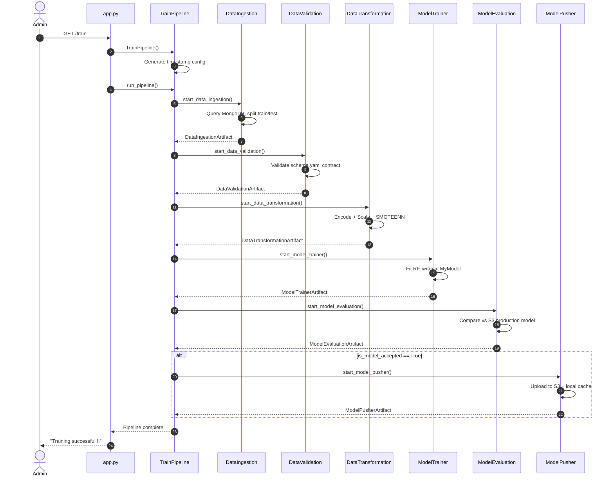

# 05. Pipeline Orchestration: Pipeline Execution & Triggers

This section details how the end-to-end training pipeline is structured, orchestrated, and triggered via web HTTP endpoints or command-line scripts.

---

## 1. `src/pipline/training_pipeline.py` (`TrainPipeline` Class)

### 1. What it does
Plain language: The master controller script that runs all six pipeline stages in exact order, passing outputs from one stage into the next stage.
Technical detail: Defines `TrainPipeline` class. Instantiates `TrainingPipelineConfig` generating a unique timestamp (`%m_%d_%Y_%H_%M_%S`). Implements step execution methods:
1. `start_data_ingestion()` -> returns `DataIngestionArtifact`
2. `start_data_validation(data_ingestion_artifact)` -> returns `DataValidationArtifact`
3. `start_data_transformation(data_ingestion_artifact, data_validation_artifact)` -> returns `DataTransformationArtifact`
4. `start_model_trainer(data_transformation_artifact)` -> returns `ModelTrainerArtifact`
5. `start_model_evaluation(data_ingestion_artifact, model_trainer_artifact)` -> returns `ModelEvaluationArtifact`
6. `start_model_pusher(model_evaluation_artifact)` -> returns `ModelPusherArtifact`

Defines `run_pipeline()` which invokes steps 1 through 6 sequentially within a structured `try-except` block.

### 2. Why it exists / What problem it solves
Provides a single, clean API entry point to execute the complete machine learning lifecycle. Without an orchestrator class, external scripts or API endpoints would have to manually instantiate and chain all six component classes individually.

### 3. What would break if it didn't exist
The system would lack an automated training workflow. Neither `app.py` nor `demo.py` could trigger automated retraining with a single function call.

### 4. Component Communications & Connections
*   **Instantiates Config**: `TrainingPipelineConfig`, `DataIngestionConfig`, `DataValidationConfig`, `DataTransformationConfig`, `ModelTrainerConfig`, `ModelEvaluationConfig`, `ModelPusherConfig`.
*   **Instantiates Components**: `DataIngestion`, `DataValidation`, `DataTransformation`, `ModelTrainer`, `ModelEvaluation`, `ModelPusher`.
*   **Called By**: `app.py` at GET `/train` endpoint and `demo.py`.
*   **Logs Output**: Emits structured log events to `logs/<timestamp>.log` via `src.logger.logging`.

### 5. Design Decisions & Tradeoffs
*   *Decision*: Monolithic Python class-based sequential orchestrator instead of an external heavyweight orchestrator like Apache Airflow or Prefect.
*   *Tradeoff*: Zero extra infrastructure overhead — runs anywhere Python runs without requiring external database schedulers or worker nodes. However, it lacks built-in task retry hooks or DAG visualization UI provided by dedicated orchestrators.

### 6. Interview Pitch
> "`TrainPipeline` is our master orchestrator. When invoked, it generates a unique run timestamp, instantiates the configuration entities, and executes all six pipeline components sequentially — passing artifacts downstream from ingestion through validation, transformation, training, evaluation, and pushing."

---

## 2. `app.py` (GET `/train` Endpoint Trigger)

### 1. What it does
Plain language: Exposes a web URL (`/train`) that allows engineers or automated systems to start a full retraining pipeline run over HTTP.
Technical detail: Defines a FastAPI route `@app.get("/train")`. When hit with a GET request, it executes:
```python
train_pipeline = TrainPipeline()
train_pipeline.run_pipeline()
return Response("Training successful !!")
```

### 2. Why it exists / What problem it solves
Allows remote pipeline execution without needing SSH terminal access to the production server.

### 3. What would break if it didn't exist
Retraining could only be executed by logging into the server command line manually and running Python scripts.

### 4. Component Communications & Connections
*   **Imports**: `from src.pipline.training_pipeline import TrainPipeline`.
*   **Triggers**: `TrainPipeline.run_pipeline()`.
*   **HTTP Response**: Returns text string `"Training successful !!"`.

### 5. Design Decisions & Tradeoffs
*   *Decision*: Synchronous GET route invocation.
*   *Tradeoff*: Easy to trigger via curl or web browser. However, because training takes several minutes, the HTTP connection remains open until completion. In high-scale production, this would be refactored to an asynchronous background task (e.g., Celery / FastAPI `BackgroundTasks`) returning a task status ID.

### 6. Interview Pitch
> "We expose training capabilities directly via FastAPI at the `/train` endpoint. Hitting this endpoint instantiates `TrainPipeline` and runs our end-to-end retraining sequence, making it easy to trigger model retraining remotely or integrate with webhooks."

---

## 3. `demo.py` (Local CLI Development Trigger)

### 1. What it does
Plain language: A simple command-line script used by developers to run the training pipeline locally on their development machine.
Technical detail: Contains a short executable script:
```python
from src.pipline.training_pipeline import TrainPipeline

pipeline = TrainPipeline()
pipeline.run_pipeline()
```

### 2. Why it exists / What problem it solves
Allows developers to test pipeline modifications locally without starting the full Uvicorn web server.

### 3. What would break if it didn't exist
Developers would have to spin up `app.py` or write ad-hoc inline Python calls every time they wanted to test code changes.

### 4. Component Communications & Connections
*   **Imports**: `src.pipline.training_pipeline.TrainPipeline`.
*   **Executes**: `pipeline.run_pipeline()`.

### 5. Design Decisions & Tradeoffs
*   *Decision*: Minimal 5-line CLI entrypoint.
*   *Tradeoff*: Highly lightweight and fast for local debugging.

### 6. Interview Pitch
> "`demo.py` is a CLI helper script for local development. It allows engineers to execute and debug the complete `TrainPipeline` from the terminal without needing to run the FastAPI web server."

---

## Pipeline Orchestration Sequence Diagram


