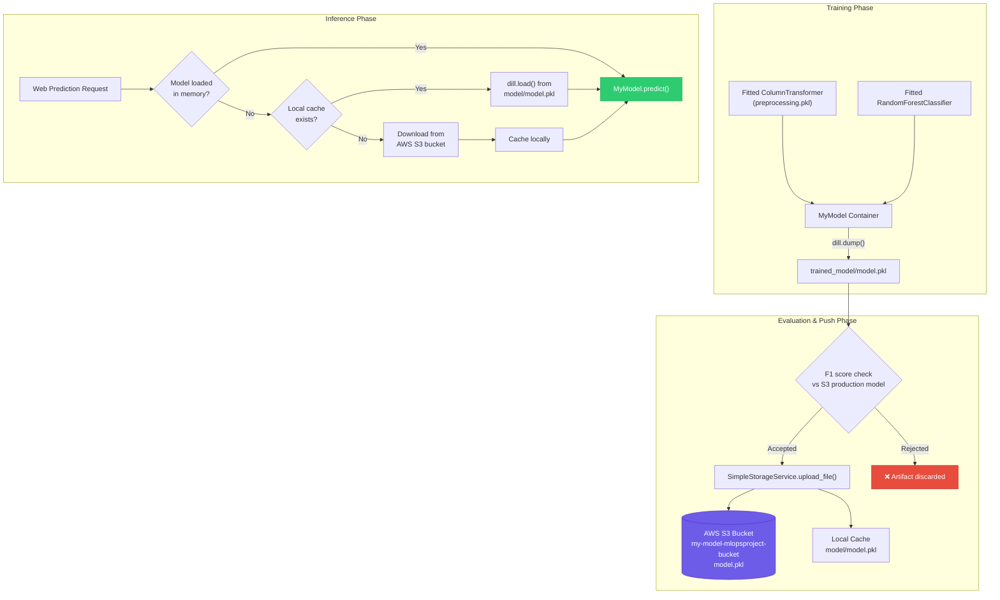
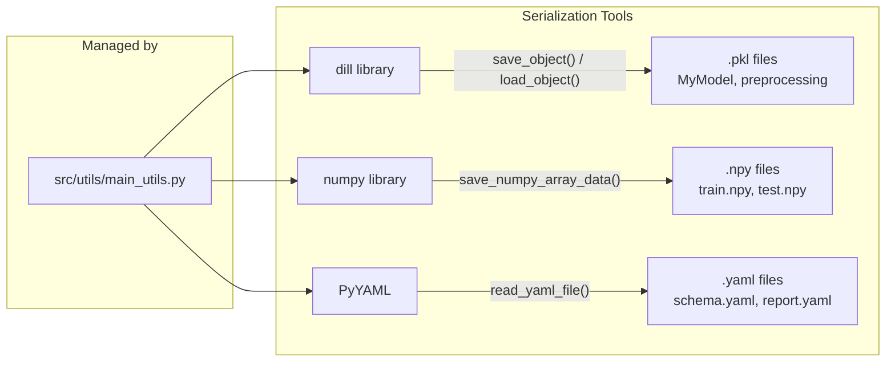

# 06. Model Packaging & Cloud Registry

This section documents how trained model objects are serialized, stored, versioned, and downloaded from the AWS S3 Cloud Model Registry.

---

## 1. `src/configuration/aws_connection.py` (`S3Client` Class)

### 1. What it does
Plain language: Establishes a secure connection to Amazon Web Services (AWS) S3 storage using environment credentials.
Technical detail: Defines `S3Client` class using Singleton pattern (`S3Client.s3_client` and `S3Client.s3_resource`). Reads `AWS_ACCESS_KEY_ID` and `AWS_SECRET_ACCESS_KEY` from environment variables, sets region to `us-east-1` (`REGION_NAME`), and initializes `boto3.resource("s3")` and `boto3.client("s3")`.

### 2. Why it exists / What problem it solves
Centralizes AWS authentication and connection management. Prevents re-authenticating with AWS API servers on every single file read or write operation.

### 3. What would break if it didn't exist
`SimpleStorageService` (`src/cloud_storage/aws_storage.py`) and `Proj1Estimator` (`src/entity/s3_estimator.py`) would be unable to interact with AWS S3, failing all model evaluation and model pusher steps.

### 4. Component Communications & Connections
*   **Imports**: `boto3`, `os`, `src.constants.AWS_ACCESS_KEY_ID_ENV_KEY`, `src.constants.AWS_SECRET_ACCESS_KEY_ENV_KEY`, `src.constants.REGION_NAME`.
*   **Reads System Credentials**: OS environment variables `AWS_ACCESS_KEY_ID`, `AWS_SECRET_ACCESS_KEY`.
*   **Called By**: `SimpleStorageService` in `src/cloud_storage/aws_storage.py`.

### 5. Design Decisions & Tradeoffs
*   *Decision*: Singleton pattern for `boto3` client initialization.
*   *Tradeoff*: Eliminates connection setup latency across S3 calls, but requires environment variable setup in deployment runners.

### 6. Interview Pitch
> "`S3Client` is a Singleton connection manager. It authenticates with AWS using boto3 session credentials pulled from environment variables, maintaining a single persistent S3 client and resource handle for all storage components."

---

## 2. `src/cloud_storage/aws_storage.py` (`SimpleStorageService` Class)

### 1. What it does
Plain language: Provides high-level Python helper functions to upload, download, list, read, and serialize objects inside AWS S3 buckets.
Technical detail: Defines `SimpleStorageService` class wrapper around `S3Client`. Methods include:
*   `s3_key_path_available(bucket_name, s3_key)`: Checks if an S3 key object exists.
*   `read_object(object_name, decode, make_dataframe)`: Reads S3 object bytes and optionally decodes/parses to Pandas DataFrame.
*   `get_file_object(filename, bucket_name)`: Fetches S3 bucket object instance.
*   `load_model(model_name, bucket_name)`: Loads a serialized model `.pkl` file directly from S3 into memory using `dill.loads()`.
*   `upload_file(from_filename, to_filename, bucket_name)`: Uploads a local file to S3.
*   `upload_df_as_csv()`, `get_df_from_object_menu()`: Utility DataFrame I/O operations.

### 2. Why it exists / What problem it solves
Abstracts low-level boto3 API mechanics (like stream buffers and byte decoding) into clean high-level method calls used by components.

### 3. What would break if it didn't exist
Components like `ModelPusher` and `ModelEvaluation` would have to write raw boto3 stream handler boilerplate code for every S3 operation.

### 4. Component Communications & Connections
*   **Imports**: `boto3`, `dill`, `pickle`, `pandas`, `io.StringIO`, `src.configuration.aws_connection.S3Client`.
*   **Called By**: `ModelPusher` (via `upload_file`), `ModelEvaluation` (via `is_model_present`), `Proj1Estimator` (via `load_model`).

### 5. Design Decisions & Tradeoffs
*   *Decision*: Use `dill` for model serialization inside S3 storage wrappers.
*   *Tradeoff*: `dill` extends Python's standard `pickle` module by serializing complex custom classes (like `MyModel`) and lambdas seamlessly, though pickle compatibility across Python minor versions must be maintained.

### 6. Interview Pitch
> "`SimpleStorageService` is our cloud storage abstraction layer. It wraps boto3 with high-level methods to check object existence, stream byte buffers directly into `dill` deserializers, and upload local model artifacts to our AWS S3 bucket registry."

---

## 3. `src/entity/s3_estimator.py` (`Proj1Estimator` Class)

### 1. What it does
Plain language: Manages fetching the active production model from AWS S3, caching it locally on disk, and serving predictions.
Technical detail: Defines `Proj1Estimator` class initialized with `bucket_name` (`my-model-mlopsproject-bucket`) and `model_path` (`model.pkl`).
*   `is_model_present()`: Checks if `model.pkl` exists in the S3 bucket.
*   `load_model()`: Downloads `model.pkl` from S3 using `SimpleStorageService` and caches it to local path `model/model.pkl`.
*   `save_model()`: Uploads local model to S3.
*   `predict(dataframe)`: Checks if model is loaded in memory; if not, calls `load_model()`. Then delegates execution to `loaded_model.predict(dataframe)`.

### 2. Why it exists / What problem it solves
Implements **lazy loading and local caching** for model inference. If the server restarts, `Proj1Estimator` automatically fetches the active production model from AWS S3 on the first request and caches it locally to avoid repeated remote network calls.

### 3. What would break if it didn't exist
`ModelEvaluation` could not compare models against S3 production versions, and `VehicleDataClassifier` (`prediction_pipeline.py`) would be unable to serve predictions from remote S3 registry storage.

### 4. Component Communications & Connections
*   **Calls Cloud Storage**: `SimpleStorageService` (`src/cloud_storage/aws_storage.py`).
*   **Encapsulates Model**: `MyModel` instance.
*   **Called By**: `ModelEvaluation.initiate_model_evaluation()` and `VehicleDataClassifier.predict()` in `src/pipline/prediction_pipeline.py`.

### 5. Design Decisions & Tradeoffs
*   *Decision*: Lazy loading pattern inside `predict()`.
*   *Tradeoff*: Accelerates web server startup time (server starts instantly without blocking on AWS S3 downloads), but defers network fetch latency to the very first inference request.

### 6. Interview Pitch
> "`Proj1Estimator` acts as our remote model proxy. It implements a lazy loading pattern that downloads the active production model from AWS S3 upon the first inference call, caches it to local disk, and invokes predictions via the embedded `MyModel` pipeline."

---

## 4. `src/utils/main_utils.py` (Local Serialization Utilities)

### 1. What it does
Plain language: Helper functions for reading/writing YAML files, serializing objects with dill to disk, and saving NumPy arrays.
Technical detail: Defines `MainUtils` helper class containing static methods:
*   `read_yaml_file(file_path)`: Reads YAML file and returns dictionary.
*   `write_yaml_file(file_path, content, replace)`: Writes dictionary to YAML file.
*   `save_object(file_path, obj)`: Serializes Python object to file using `dill.dump()`.
*   `load_object(file_path)`: Loads serialized Python object using `dill.load()`.
*   `save_numpy_array_data(file_path, array)`: Saves NumPy array using `np.save()`.
*   `load_numpy_array_data(file_path)`: Loads NumPy array using `np.load()`.

### 2. Why it exists / What problem it solves
Centralizes all local file I/O operations into clean, reusable utility functions with standard exception handling.

### 3. What would break if it didn't exist
Every component would have to rewrite file opening, dill dumping, YAML loading, and directory creation logic.

### 4. Component Communications & Connections
*   **Called By**: `DataIngestion`, `DataValidation`, `DataTransformation`, `ModelTrainer`, `ModelEvaluation`, `ModelPusher`.

### 5. Design Decisions & Tradeoffs
*   *Decision*: Automatically create parent directories (`os.makedirs(dir_path, exist_ok=True)`) inside `save_object()` and `save_numpy_array_data()`.
*   *Tradeoff*: Prevents runtime `FileNotFoundError` exceptions when writing artifacts to new timestamped folders.

### 6. Interview Pitch
> "`MainUtils` is our core file I/O layer. It standardizes disk operations across all components, handling YAML configuration parsing, NumPy array persistence via `np.save`, and object serialization using `dill` while automatically handling directory creation."

---

## Model Packaging & S3 Registry Flow

## Serialization Stack

