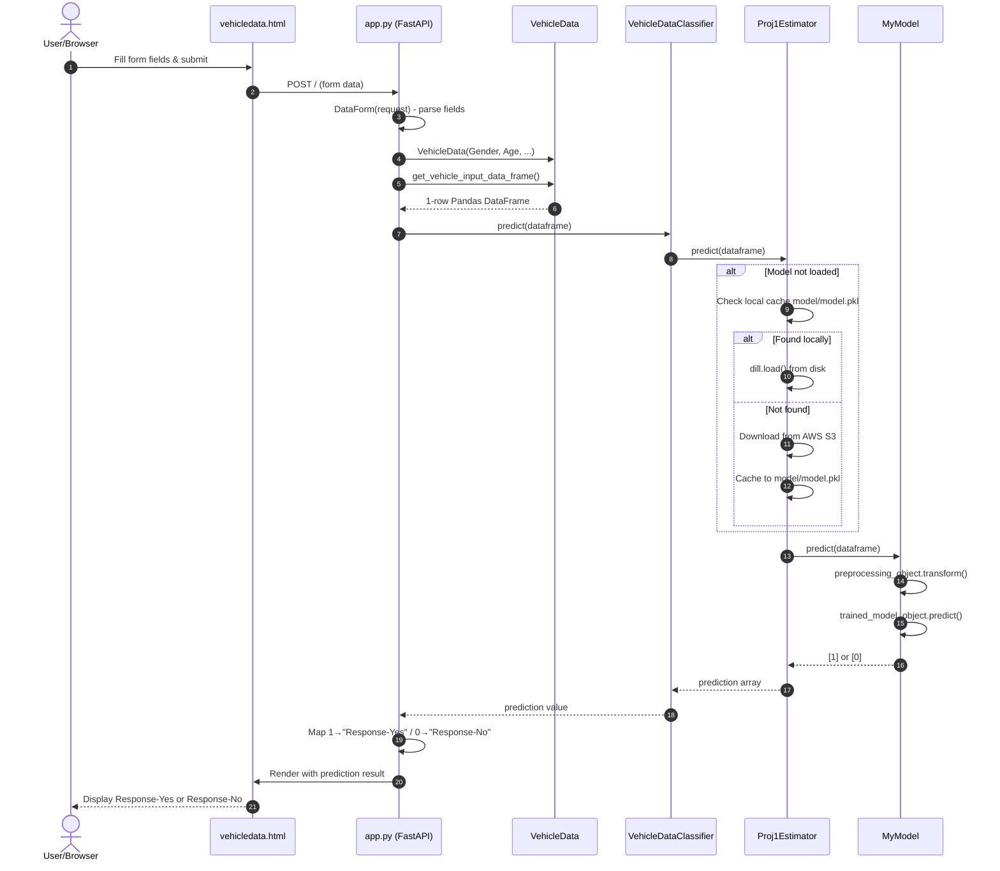
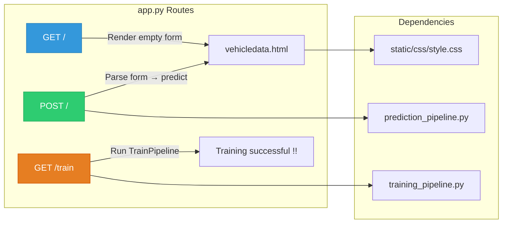

# 07. Deployment Layer: Web Serving & Inference Pipeline

This section documents the serving layer responsible for accepting incoming web user requests, parsing input data, loading production models, and serving real-time predictions via FastAPI.

---

## 1. `app.py` (FastAPI Server Application)

### 1. What it does
Plain language: The main web application server that hosts our prediction webpage and handles user interactions.
Technical detail: Instantiates `FastAPI()` application. Mounts static CSS directory (`/static`), configures Jinja2 HTML templates (`templates`), configures CORS middleware (`CORSMiddleware` allowing all origins `*`), and defines HTTP routes:
*   `GET /`: Renders `vehicledata.html` with an empty form context.
*   `POST /`: Accepts web form data asynchronously via `DataForm(request)`, parses inputs into `VehicleData`, invokes `VehicleDataClassifier.predict()`, maps numerical prediction (`1` -> `"Response-Yes"`, `0` -> `"Response-No"`), and re-renders `vehicledata.html` displaying the prediction result.
*   `GET /train`: Triggers `TrainPipeline.run_pipeline()`.
*   Runs server via `uvicorn.run(app, host=APP_HOST, port=APP_PORT)`.

### 2. Why it exists / What problem it solves
Exposes our trained machine learning model to real-world users and web applications over standard HTTP interfaces.

### 3. What would break if it didn't exist
The machine learning pipeline would exist only as offline code; users would have no web interface or API endpoint to query predictions.

### 4. Component Communications & Connections
*   **Imports**: `fastapi`, `starlette.requests.Request`, `fastapi.templating.Jinja2Templates`, `fastapi.staticfiles.StaticFiles`, `src.constants.APP_HOST`, `src.constants.APP_PORT`, `src.pipline.prediction_pipeline.VehicleData`, `src.pipline.prediction_pipeline.VehicleDataClassifier`, `src.pipline.training_pipeline.TrainPipeline`.
*   **Renders**: `templates/vehicledata.html`.
*   **Serves**: `static/css/style.css`.

### 5. Design Decisions & Tradeoffs
*   *Decision*: Custom `DataForm` request helper parsing form values directly into Jinja2 templates.
*   *Tradeoff*: Combines web page rendering and API prediction into one user-friendly application. For headless microservice architectures, pure JSON request/response endpoints would be added alongside.

### 6. Interview Pitch
> "`app.py` is our FastAPI serving engine. It mounts static assets, initializes Jinja2 HTML templating, and handles both POST prediction requests and GET training triggers. On POST requests, it parses web form inputs into a `VehicleData` object and passes it to our prediction pipeline."

---

## 2. `src/pipline/prediction_pipeline.py` (`VehicleData` & `VehicleDataClassifier`)

### 1. What it does
Plain language: Transforms raw web form fields into a 1-row Pandas DataFrame and feeds it to our model estimator for prediction.
Technical detail: Contains two core classes:
1.  `VehicleData`: Dataclass-like container initialized with individual feature values (`Gender`, `Age`, `Driving_License`, `Region_Code`, `Previously_Insured`, `Vehicle_Age`, `Vehicle_Damage`, `Annual_Premium`, `Policy_Sales_Channel`, `Vintage`).
    *   `get_vehicle_input_data_frame()`: Formats these inputs into a 1-row Pandas DataFrame matching the exact feature names and column order used during training.
2.  `VehicleDataClassifier`: Serving manager initialized with `prediction_pipeline_config`.
    *   `predict(dataframe)`: Instantiates `Proj1Estimator` (`src/entity/s3_estimator.py`) if not already loaded, and calls `model.predict(dataframe)` to return the class array (`[1]` or `[0]`).

### 2. Why it exists / What problem it solves
Bridges the gap between raw web request parameters and scikit-learn DataFrame input expectations. Guarantees that single-row web inputs have identical column names, types, and ordering as batch training DataFrames.

### 3. What would break if it didn't exist
`app.py` would have to construct pandas DataFrames manually, leading to code duplication and column ordering bugs during inference.

### 4. Component Communications & Connections
*   **Instantiated By**: `app.py` on incoming `POST /` requests.
*   **Calls Cloud/Model Layer**: `Proj1Estimator` (`src/entity/s3_estimator.py`).
*   **Outputs Data To**: Returns numpy array prediction (`[1]` or `[0]`) to `app.py`.

### 5. Design Decisions & Tradeoffs
*   *Decision*: Web form submits pre-mapped numeric values (e.g. `Gender` as `1`/`0`, `Vehicle_Age` as dummy columns) directly matching the 11-column transformed schema expected by `MyModel`.
*   *Tradeoff*: Streamlines web inference preprocessing speed by skipping redundant pandas string mapping operations during single-sample scoring.

### 6. Interview Pitch
> "`prediction_pipeline.py` contains `VehicleData` and `VehicleDataClassifier`. `VehicleData` converts incoming web form inputs into a structured single-row Pandas DataFrame, while `VehicleDataClassifier` delegates prediction execution to `Proj1Estimator`, returning binary conversion predictions in real time."

---

## 3. `templates/vehicledata.html` & `static/css/style.css`

### 1. What it does
Plain language: The visual user interface (HTML form and CSS styling) that users interact with in their web browser.
Technical detail:
*   `templates/vehicledata.html`: A Jinja2 HTML template containing form fields (`<select>` and `<input>`) for all vehicle insurance parameters. Submits via `POST /`. Uses Jinja2 tags (`{{context}}`) to display the output banner (**`Response-Yes`** or **`Response-No`**).
*   `static/css/style.css`: Provides responsive visual styling, form layouts, button hover states, and background formatting.

### 2. Why it exists / What problem it solves
Provides a user-friendly GUI for non-technical stakeholders, business domain experts, and sales representatives to test the model visually.

### 3. What would break if it didn't exist
`app.py` would throw a Jinja2 `TemplateNotFound` error when rendering `GET /` or `POST /`.

### 4. Component Communications & Connections
*   **Rendered By**: `templates.TemplateResponse("vehicledata.html", ...)` in `app.py`.
*   **Linked Asset**: `<link href="/static/css/style.css" rel="stylesheet">`.

### 5. Design Decisions & Tradeoffs
*   *Decision*: Jinja2 template rendering embedded directly inside FastAPI.
*   *Tradeoff*: Delivers a self-contained web app without requiring a separate Node.js/React frontend deployment, simplifying infrastructure footprint.

### 6. Interview Pitch
> "`vehicledata.html` and `style.css` form our web user interface. Rendered via FastAPI's Jinja2 template engine, the HTML form collects customer demographics and posts them to our endpoint, displaying the final prediction result directly on the webpage."

---

## Web Prediction Request Lifecycle

## FastAPI Route Map

