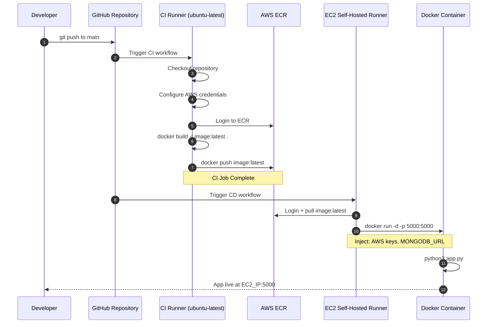
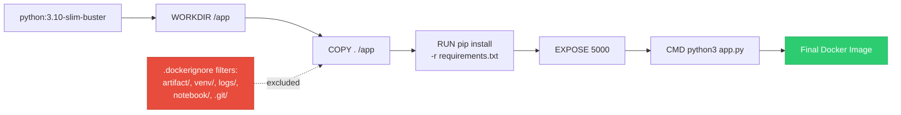
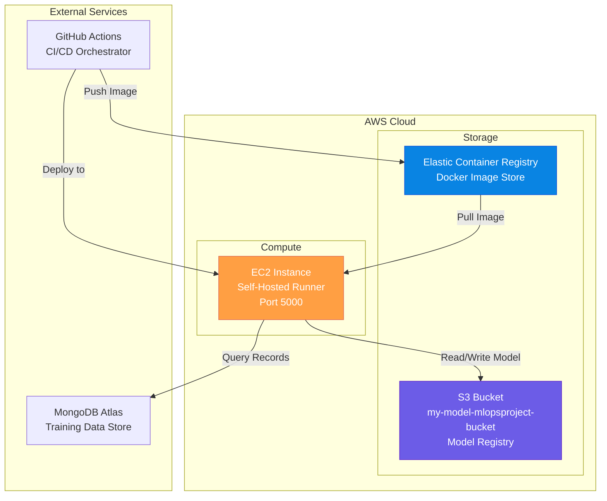

# 08. Infrastructure & DevOps: Containerization, Packaging, and CI/CD

This section documents containerization rules, Python package setup specifications, and GitHub Actions CI/CD automation targeting AWS cloud infrastructure.

---

## 1. `Dockerfile` & `.dockerignore`

### 1. What it does
Plain language: Instructions for packaging our entire Python web application and its dependencies into a lightweight, portable Docker container image.
Technical detail:
*   `Dockerfile`: Uses base image `python:3.10-slim-buster`. Sets working directory `/app`. Copies local files into container (`COPY . /app`). Installs dependencies via `RUN pip install -r requirements.txt`. Exposes port `5000`. Specifies container startup command `CMD ["python3", "app.py"]`.
*   `.dockerignore`: Excludes build bloat and sensitive files from the Docker context: `artifact/`, `venv/`, `logs/`, `notebook/`, `.git/`.

### 2. Why it exists / What problem it solves
Solves **"works on my machine"** inconsistency. Guarantees that Python 3.10 runtime environment, system C libraries, and dependencies are identical in local dev and AWS EC2 production environments.

### 3. What would break if it didn't exist
The CI/CD pipeline (`aws.yaml`) could not build a Docker container image, blocking containerized cloud deployment to AWS ECR/EC2.

### 4. Component Communications & Connections
*   **Invoked By**: `docker build` command in GitHub Actions CI workflow (`.github/workflows/aws.yaml`).
*   **Installs**: Libraries specified in `requirements.txt` (which invokes `setup.py` via `-e .`).
*   **Runs Command**: `python3 app.py` to start FastAPI server inside container on port 5000.

### 5. Design Decisions & Tradeoffs
*   *Decision*: Use `python:3.10-slim-buster` base image instead of full `python:3.10`.
*   *Tradeoff*: Dramatically reduces container image size (~150MB vs ~1GB), accelerating ECR push/pull speeds and minimizing vulnerability surface area.

### 6. Interview Pitch
> "Our `Dockerfile` containerizes the application using `python:3.10-slim-buster`. `.dockerignore` filters out local logs, notebooks, and virtual environments, keeping the build context lean so ECR image pushes and EC2 deployment pulls complete rapidly."

---

## 2. `.github/workflows/aws.yaml` (GitHub Actions CI/CD)

### 1. What it does
Plain language: An automated workflow script that runs whenever code is pushed to GitHub `main` branch. It automatically builds a new Docker container, pushes it to AWS ECR, and deploys it on an AWS EC2 instance.
Technical detail: Defines two GitHub Actions jobs:
1.  `continuous-integration`: Runs on `ubuntu-latest`.
    *   Checks out code.
    *   Authenticates with AWS using repository secrets (`AWS_ACCESS_KEY_ID`, `AWS_SECRET_ACCESS_KEY`, `AWS_DEFAULT_REGION`).
    *   Logs into AWS Elastic Container Registry (ECR).
    *   Builds, tags, and pushes Docker image to AWS ECR (`${{ secrets.AWS_ECR_LOGIN_URI }}/${{ secrets.ECR_REPOSITORY_NAME }}:latest`).
2.  `continuous-deployment`: Runs on a `self-hosted` runner active on the target AWS EC2 instance.
    *   Authenticates with AWS and logs into ECR on the EC2 machine.
    *   Pulls the latest Docker image from AWS ECR.
    *   Executes `docker run -d -p 5000:5000` passing environment variables (`AWS_ACCESS_KEY_ID`, `AWS_SECRET_ACCESS_KEY`, `AWS_DEFAULT_REGION`, `MONGODB_URL`).

### 2. Why it exists / What problem it solves
Automates Continuous Deployment (CD). Eliminates manual SSH server logins, manual image builds, or manual environment variable setups whenever code updates are merged.

### 3. What would break if it didn't exist
Every deployment would require manual terminal intervention on AWS EC2 servers.

### 4. Component Communications & Connections
*   **Triggers On**: `git push` to `main` branch.
*   **Uses AWS Services**: AWS ECR (Container Registry) and AWS EC2 (Compute Host).
*   **Passes Env Vars**: `AWS_ACCESS_KEY_ID`, `AWS_SECRET_ACCESS_KEY`, `AWS_DEFAULT_REGION`, `MONGODB_URL` into running Docker container.

### 5. Design Decisions & Tradeoffs
*   *Decision*: Use an AWS EC2 self-hosted runner for the CD job.
*   *Tradeoff*: Self-hosted runner allows GitHub Actions to execute `docker run` directly inside our target EC2 instance without exposing SSH keys or requiring inbound SSH ports on the EC2 firewall.

### 6. Interview Pitch
> "We automate deployment using a two-stage GitHub Actions workflow in `aws.yaml`. On push to main, the CI job builds our Docker image and pushes it to AWS ECR. The CD job runs on an EC2 self-hosted runner, pulls the latest image from ECR, and spins up the container with secret environment variables injected."

---

## 3. `setup.py`, `pyproject.toml`, & `requirements.txt`

### 1. What it does
Plain language: Configures our `src` folder as an installable Python library package and defines third-party dependencies.
Technical detail:
*   `setup.py`: Uses `setuptools.setup()` with `packages=find_packages()`.
*   `pyproject.toml`: Modern PEP 517 build system configuration specifying `setuptools.build_meta` build backend and dynamic dependency reading from `requirements.txt`.
*   `requirements.txt`: Specifies library pins (`scikit-learn==1.5.2`, `fastapi`, `uvicorn`, `pymongo`, `boto3`, `imblearn`, `dill`). Contains `-e .` on the last line.

### 2. Why it exists / What problem it solves
The `-e .` flag in `requirements.txt` combined with `setup.py` installs the `src/` directory as an editable local Python package. This enables absolute dot-notation imports (`from src.logger import logging`) across any file without modifying `sys.path`.

### 3. What would break if it didn't exist
Python would throw `ModuleNotFoundError: No module named 'src'` whenever running scripts from different directory working locations.

### 4. Component Communications & Connections
*   **Invoked By**: `pip install -r requirements.txt`.
*   **Packages**: Entire `src/` module (`src.components`, `src.entity`, `src.logger`, etc.).

### 5. Design Decisions & Tradeoffs
*   *Decision*: Use `-e .` editable installation mode via `setup.py`.
*   *Tradeoff*: Clean, PEP-compliant import resolution across the entire repository without messy `sys.path.append()` hacks.

### 6. Interview Pitch
> "We package our application using `setup.py` and `pyproject.toml`. Including `-e .` in `requirements.txt` installs `src` in editable mode during pip installation, ensuring clean absolute package imports across all components and deployment environments."

---

## CI/CD Pipeline Swimlane Diagram

## Docker Build Lifecycle

## AWS Infrastructure Map

