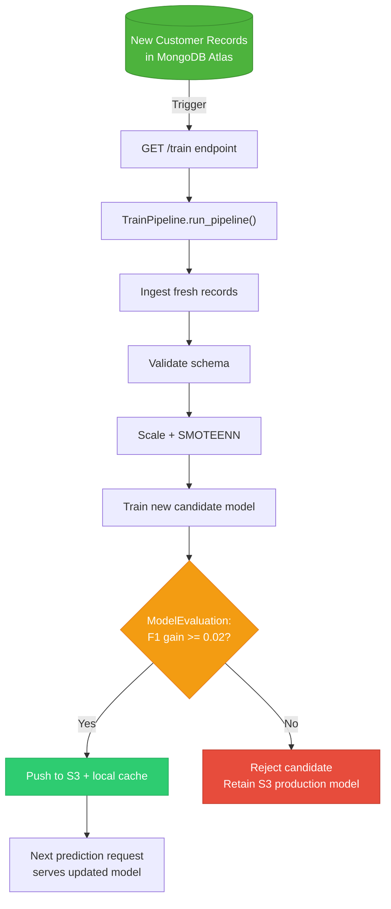

# 09. Monitoring, Exception Handling, & Feedback Retraining Loops

This section documents operational logging, custom exception tracing, runtime feedback monitoring, and retraining triggers that close the MLOps loop back into training.

---

## 1. `src/logger/__init__.py`

### 1. What it does
Plain language: Automatically creates timestamped log files (`logs/MM_DD_YYYY_HH_MM_SS.log`) and captures formatted event messages across all components.
Technical detail: Module-level logger setup. Creates a `logs/` directory. Generates a timestamped filename string `LOG_FILE`. Configures standard `logging.basicConfig()`:
*   `filename`: `os.path.join(logs_path, LOG_FILE)`.
*   `format`: `"[ %(asctime)s ] %(lineno)d %(name)s - %(levelname)s - %(message)s"`.
*   `level`: `logging.INFO`.

Executes module initialization logging immediately upon import.

### 2. Why it exists / What problem it solves
Provides operational observability. When errors or pipeline halts occur, engineers can inspect structured log files to trace execution timelines and pinpoint exact failures.

### 3. What would break if it didn't exist
The system would operate as a black box without persistent execution audit trails. Debugging pipeline issues would require adding manual print statements.

### 4. Component Communications & Connections
*   **Imported By**: `src/components/*`, `src/pipline/*`, `src/configuration/*`, `src/data_access/*`, `app.py`.
*   **Outputs File To**: `logs/<timestamp>.log`.

### 5. Design Decisions & Tradeoffs
*   *Decision*: Timestamped log files created on every execution run.
*   *Tradeoff*: Guarantees isolated log files per run. In high-volume production microservices, streaming logs to stdout for aggregation by CloudWatch or ELK stack is preferred over local disk log retention.

### 6. Interview Pitch
> "Our logging module sets up a structured file handler on import. It formats log entries with timestamps, file names, line numbers, and severity levels, persisting audit logs into timestamped files for complete operational observability."

---

## 2. `src/exception/__init__.py` (`MyException` Class)

### 1. What it does
Plain language: Captures detailed Python errors, extracting the exact script filename and line number where the failure occurred.
Technical detail: Defines `MyException` inheriting from Python's base `Exception`. Implements `error_message_detail(error, error_detail)`:
*   Uses `sys.exc_info()` to extract exception traceback tuple `(_, _, exc_tb)`.
*   Extracts filename `exc_tb.tb_frame.f_code.co_filename` and line number `exc_tb.tb_lineno`.
*   Formats custom error string: `"Error occurred in python script name [{0}] line number [{1}] error message [{2}]"`.

Overrides `__str__()` to return this detailed message.

### 2. Why it exists / What problem it solves
Standard Python exception tracebacks can be lost or obscured when caught inside generic `try-except` blocks. `MyException` guarantees that exact script line numbers are logged.

### 3. What would break if it didn't exist
Exceptions caught across components would print generic error strings without script line context, slowing root cause analysis.

### 4. Component Communications & Connections
*   **Imports**: `sys`, `src.logger.logging`.
*   **Used By**: All `try-except` blocks across `src/components/*`, `src/configuration/*`, `src/data_access/*`, `src/pipline/*`.

### 5. Design Decisions & Tradeoffs
*   *Decision*: Inspecting `sys.exc_info()` inside a custom exception wrapper.
*   *Tradeoff*: Adds traceback extraction code overhead, but provides instant developer clarity on error locations during debugging.

### 6. Interview Pitch
> "`MyException` is our custom exception handler. By inspecting `sys.exc_info()`, it extracts the exact script filename and line number of any failure, constructing a detailed error string that is logged across all pipeline components."

---

## 3. Retraining Loop & Feedback Monitoring Architecture

### 1. How the Loop Closes

1.  **Data Accumulation**: As new customer interactions take place, fresh records accumulate in MongoDB Atlas (`Proj1-Data`).
2.  **Triggering Retraining**: Retraining can be triggered periodically or via webhooks hitting the `GET /train` endpoint in `app.py`.
3.  **Validation & Evaluation Safety**: `TrainPipeline` ingests fresh records, re-validates schema, re-fits SMOTEENN scaling, and trains a candidate model.
4.  **Automated Gatekeeping**: `ModelEvaluation` compares the new model against the current active S3 production model. If performance has degraded or improved by $< 0.02$ F1-score, the candidate model is rejected and discarded.
5.  **Seamless Rollout**: If accepted, `ModelPusher` overwrites `model.pkl` in S3 and local cache. The next POST prediction request handled by `prediction_pipeline.py` immediately serves predictions using the updated model.

### 2. Interview Pitch
> "Our retraining loop is fully automated and guarded. When new data arrives in MongoDB, hitting `/train` executes `TrainPipeline`. `ModelEvaluation` acts as an automated circuit breaker — comparing the candidate against the live AWS S3 model. The live model is only overwritten if the new candidate achieves a verified F1-score improvement of at least 0.02."
